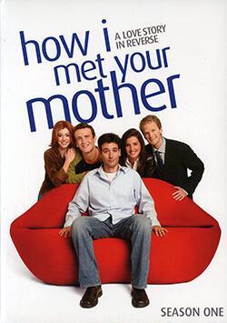

<link href="https://cdn.bootcss.com/bootstrap/3.3.7/css/bootstrap.min.css" rel="stylesheet">

> "开启美式爱情之旅"

## 剧情简介

    

        
    

    

        <h4 class="media-heading">How I Met Your Mother Season 1</h4>
        <small>导演: 帕梅拉·福莱曼</small> 
        <small>编剧: 卡特·贝斯 / Craig Thomas</small>
        <small>主演: 乔什·拉德诺 / 杰森·席格尔 / 艾丽森·汉妮根 / 尼尔·帕特里克·哈里斯 / 寇碧·史莫德斯</small> 
        <small>类型: 喜剧 / 爱情</small> 
        <small>官方网站: <a href="http://www.cbs.com/primetime/how_i_met_your_mother">www.cbs.com/primetime/how_i_met_your_mother</a></small> 
        <small>制片国家/地区: 美国</small> 
        <small>语言: 英语</small> 
        <small>集数: 22</small> 
        <small>单集片长: 25分钟</small> 
    

 

<small class="intro">
　  泰德（乔什·拉德诺 Josh Radnor 饰）、马修（杰森·席格尔 Jason Segel 饰）和巴尼（尼尔·帕特里克·哈里斯 Neil Patrick Harris 饰）是三个好友，其中只有马修拥有一份稳定爱情——他很快要和幼儿园老师莉莉（艾丽森·汉妮根 Alyson Hannigan 饰）结婚了。而巴尼是个典型花花公子，对他来说，安定下来是不可能的。泰德倒是很想找到所爱，进入正常婚姻生活，也终于在酒吧遇到了心中的女神——美丽女主播罗宾（寇碧·史莫德斯 Cobie Smulders），岂料第一次约会，泰德就心急表白，将女神吓到了。为了解决泰德的爱情困扰，几位损友争相为他出主意，罗宾也慢慢进入他们的好友圈……  
　　本剧最特别之处在于以泰德未来小孩的口吻倒叙，但老爸可以确定的情况下，到底谁是老妈？始终是全剧最大悬念。
</small>

## 视频、字幕

[How I Met Your Mother Season 1 720P Download](http://www.kmeiju.net/archives/504.html#download) 
[How I Met Your Mother Season 1 中英字幕 Download](/res/himyms1_subtitle.zip)
