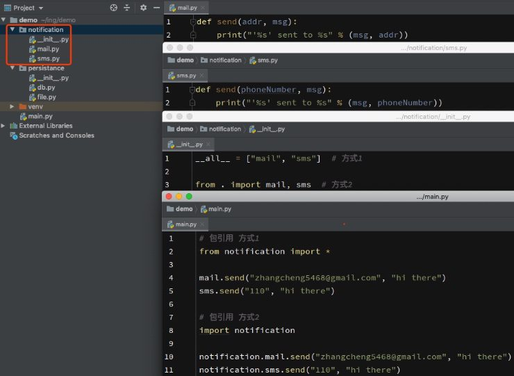

# 模块/包

## 1. 模块简介
有过C语言编程经验的朋友都知道在C语言中如果要引用sqrt函数，必须用语句`#include <math.h>`引入`math.h`这个头文件，否则是无法正常进行调用的。

在python中有一个概念叫做模块（module），这个和C语言中的头文件以及Java中的包很类似。模块就好比是工具包，要想使用这个工具包中的工具(就好比函数)，就需要导入这个模块

在python中，相关功能代码写到一个python文件中，我们就称该文件为模块，模块的名字就是文件的名字。如果模块需要在其他地方使用，文件名需要严格遵循标识符命名规范。
## 2. 使用模块
导入一个模块时，python会首先把模块文件的代码执行一遍。

为了提升代码执行效率，解释器会在首次程序执行时把需要使用的模块解释成的字节码文件缓存到`__pycache__`目录下，缓存文件名一般为`模块名.解释器.python版本.pyc`。程序下次执行需要调用模块时会首先从缓存中读取，避免耗时的重复解释。

### 2.1 import
在python中用关键字import来引入某个模块。使用`模块名.成员名`方式调用的。

```py
import time   # 引入time模块

time.ctime()  # 调用time模块ctime函数
time.sleep(5)  # 让程序延迟执行5秒
```

### 2.2 from...import...
#### 2.2.1 导入模块成员
如果要引用某个模块中指定成员,可以使用`from module import member`语法。这只会单独引入指定的成员，而不会引入整个模块。

```py
from math import sqrt,sin  # 引入math模块的sqrt和sin函数

sqrt(4)  # 调用引入的模块函数
sin(60)

'''
此方式引入，调用函数时只能给出函数名，不能给出模块名
当多个模块中含有相同名称函数时，后面引入会覆盖前面引入

如先引入A模块funciton(),再引入B模块function(),调用function函数会执行B模块的function()
'''
```

::: tip 引入模块全部内容
如果要引入一个模块的全部内容有以下两种方式。
:::
```py
import module

from module import *
```

第一种方式通过模块名.成员名访问模块成员。第二种方式直接使用成员名访问模块成员，会存在不同模块之间同名成员覆盖的问题(可以通过`as`使用别名区分)。推荐使用第一种方式。

#### 2.2.2 导入模块
如果要引用某个路径中指定模块,可以使用`from path import module`语法。python3中在非根目录中模块之间引用不支持使用`import module`方式，此时就需要使用`from path import module`。python2同时支持以上两种语法。

在包的`__init__`文件中导入包中模块时常用此语法。

### 2.3 别名
`import`模块时可以使用`as`关键字定义模块或模块成员别名。定义别名后原名不能再使用。

* 模块别名

```py
import math as mt

mt.sqrt(4)
```

* 模块成员别名

```py
from math import sqrt as kf

kf(4)
```

### 2.4 模块定位
导入模块后，python解析器对模块位置的搜索顺序如下：

* 当前目录
* Shell变量`PYTHONPATH`下的每个目录。
* 默认路径。UNIX下，默认路径一般为`/usr/local/lib/python/`

模块搜索路径存储在`sys`模块的`sys.path`变量中。变量里包含当前目录，`PYTHONPATH`和由安装过程决定的默认目录。

## 3. 相关系统变量
### 3.1 \_\_name\_\_
实际开中，模块编写完成后，为了验证模块是否达到预期效果，通常会在模块文件中添加一些测试代码，但测试代码不应该在模块被外部调用时执行。

python模块在执行时有一个`__name__`变量表征当前代码被执行调用的文件。此变量值为`__main__`时表示当前在模块定义文件内部执行,否则为模块被外部调用，值为引用此模块的文件名(不含扩展名)。因此，我们可以选择性的执行模块测试代码。

`calc.py`:
```py
def sum(a, b):
    return a + b


# 以下测试代码只会在该模块内部执行
if __name__ == '__main__':
    a, b = 1, 2
    c = sum(a, b)
    print("test inside. %d + %d = %d" % (a, b, c))
```
`main.py`:
```py
import calc # 导入模块时不会打印测试信息


sum = calc.sum(1, 2)
print(sum)
```

除了模块外，类和函数也有`__name__`属性表示自身名称。

```py
class Person:
    def sayHi():
        pass

Person.__name__  # Person
Person().sayHi.__name__  # sayHi
```

### 3.2 \_\_all\_\_
#### 3.2.1 模块
当使用`from ... import *`方式导入一个模块全部内容时，在模块中可以通过`__all__`变量指定对外公开的成员，只有在其列表中的成员才允许被外部使用。

通过`import...`方式导入时，`__all__`无效。

`test.py`:
```py
__all__ = ["TestClass", "sum"]


class TestClass:
    pass


num = 123


def sum(a, b):
    return a + b
```

`main.py`:
```py
from test import *

c = TestClass()
sum(1, 2)
print(num)  # 异常。num没有出现在test模块的__all__列表中，外部不可访问
```

#### 3.2.2 包
通过`from ... import *`方式导入包时，在包的`__init__`文件中可以通过`__all__`指定对外公开的模块，只有在其列表中的模块才允许被外部使用。

相关使用方式参阅 [包](#_5-包)。

## 4. 包
### 4.1 包使用简介
日常开发中，我们通常会将关联性较强的模块组织在一起，放在同一个目录下，为了管理其中的模块，我们通常通会在目录中建一个名为`__init__.py`的特殊文件(python2必须,python3非必须)，类似于模块清单，此时我们就把这个目录就称之为包。python包相当于C#中的类库和Java中的包。

当包被引用时，会首先执行包的`__init__.py`文件,它控制着包的导入行为。与模块使用类似，包也有两种引用方式，示例如下图：



包支持嵌套使用，即在包中包含子包，多级目录。

### 4.2 发布包
包开发完成后，如果想共享给他人，就需要我们发布包。
#### 1) 配置
假设我们有包目录结构如下。
```
.
├── setup.py
├── notification
│   ├── __init__.py
│   ├── mail.py
│   └── sms.py
└── persistance
    ├── __init__.py
    ├── db.py
    └── file.py
```
在包同级目录下创建`setup.py`文件，内容如下：
```py
from distutils.core import setup

setup(name="colinutils", version="1.0", description="some utils", author="colin chang",
      py_modules=['notification.mail', 'notification.sms', 'persistance.db', 'persistance.file'])
```
#### 2) 构建
```sh
python3 setup.py build
```
构建完成后会生成`build`目录。
```py
.
├── build
│   └── lib
│       ├── notification
│       │   ├── __init__.py
│       │   ├── mail.py
│       │   └── sms.py
│       └── persistance
│           ├── __init__.py
│           ├── db.py
│           └── file.py
├── setup.py
├── notification
│   ├── __init__.py
│   ├── mail.py
│   └── sms.py
└── persistance
    ├── __init__.py
    ├── db.py
    └── file.py
```
#### 3) 打包
```sh
python3 setup.py sdist
```
打包完成后会生成`dist`目录和`MANIFEST`文件,压缩包`colinutils-1.0.tar.gz`生成在`dist`目录下。
```py
.
├── build
│   └── lib
│       ├── notification
│       │   ├── __init__.py
│       │   ├── mail.py
│       │   └── sms.py
│       └── persistance
│           ├── __init__.py
│           ├── db.py
│           └── file.py
├── dist
│   └── colinutils-1.0.tar.gz
├── MANIFEST.py
├── setup.py
├── notification
│   ├── __init__.py
│   ├── mail.py
│   └── sms.py
└── persistance
    ├── __init__.py
    ├── db.py
    └── file.py
```
至此包的发布就完成了，我们可以把生成的压缩包分享给他人。

#### 4) 安装
拿到分享的压缩包后解压执行如下命令进行安装
```sh
tar -zxvf colinutils-1.0.tar.gz && cd colinutils-1.0 # 解压并进入解压目录
python3 setup.py install
```

#### 5) 引用
安装完成后就可以像系统模块一样在任意位置所以使用。
```py
# 方式1
from notification import *

mail.send("zhangcheng5468@gmail.com", "hi there")
sms.send("110", "hi there")

# 方式2
import persistance

persistance.db.save("db0", "data")
persistance.file.save("file.txt", "data")
```