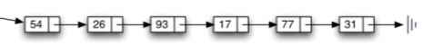
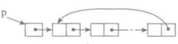
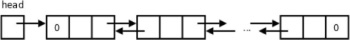

# 链表

## 1. 链表
链表(linked list)是一种物理存储单元上非连续、非顺序的存储结构，数据元素的逻辑顺序是通过链表中的指针链接次序实现的。链表由一系列结点（链表中每一个元素称为结点）组成，结点可以在运行时动态生成。每个结点包括两个部分：一个是存储数据元素的数据域，另一个是存储下一个结点地址的指针域。

链表定位元素只能按照指针链，逐个查找，没有顺序表的索引结构。链表中CRUD操作的时间复杂度分别为，头插法`O(1)`,尾插法和定位插入`O(n)`,删除`O(n)`，修改和查询均为`O(n)`。

## 2. 单向链表



单向链(Single Linked List)表也叫单链表，是链表中最简单的一种形式，单链表中的数据是以结点来表示的，每个结点的构成：元素 + 指针，元素就是存储数据的存储单元，指针就是连接每个结点的地址数据。

单链表中每个结点的存储地址是存放在其前趋结点next域中，而开始结点无前趋，故应设头指针`head`指向开始结点。链表由头指针唯一确定，单链表可以用头指针的名字来命名。终端结点无后继，故终端结点的指针域为空(None)。

## 3. 单向循环链表
单向循环链表是单链表的另一种形式，其结构特点链表中最后一个结点的指针域不再是结束标记，而是指向整个链表的第一个结点，从而使链表形成一个环。



## 4. 双向链表
双向链表也叫双链表，是链表的一种，它的每个数据结点中都有两个指针，分别指向直接后继和直接前驱。所以，从双向链表中的任意一个结点开始，都可以很方便地访问它的前驱结点和后继结点。一般我们都构造双向循环链表。



## 5. 顺序表与链表
顺序表与链表同属线性表。

顺序表利用连续内存地址关联元素，可以迅速定位元素位置，查询和更新操作比较高效，但大量频繁的扩充元素则需要重新申请大块连续内存迁移所有的元素，执行效率偏低，删除操作则需要将删除元素后的所有元素前移。

链表通过节点指针串联元素，可以更好地利用非连续内存，但定位节点只能顺着指针连逐次查找，因此查询很更新操作比较低效。但新增节点则只需要申请新的内存挂在到现有链表中，删除元素则只需要修改前驱和后继节点的指针指向即可，因此新增和删除操作更加灵活高效。

在数据元素较少且规模相对固定，更多执行查询和更新操作的场景中，推荐使用稳定性更好的顺序表；相反的，数据规模未知且变动频繁，更多执行插入和删除操作的场景中推荐使用链表。

## 6. Python 链表

链表结构在不同的开发平台都有各自语言的版本实现，如链表在C#当中实现为`LinkedList<T>`，而Python并没有内建链表实现，需要我们自定义实现。

> 以下自定义链表模块可在 [Github](https://github.com/colin-chang/linklist) 获取

```py
__all__ = ["SingleLinkList", "SingleCycleLinkList", "DoubleLinkList"]


class SingleNode(object):
    """单链表节点"""

    def __init__(self, elem):
        self.elem = elem
        self.next = None


class DoubleNode(SingleNode):
    """双链表节点"""

    def __init__(self, elem):
        self.prev = None
        super().__init__(elem)


class _LinkedList(object):
    """抽象抽象类，只用于被继承，不能实例化"""

    def __init__(self):
        self.head = None

    def __str__(self, end=" -> "):
        """遍历输出整个链表"""
        cur = self.head
        elems = []
        while cur != None:
            elems.append(str(cur.elem))
            cur = cur.next

        return end.join(elems)

    def is_empty(self):
        """链表是否为空"""
        return self.head == None

    def length(self):
        """链表长度"""
        # cur游标，用来移动遍历节点
        cur = self.head
        # count记录数量
        count = 0
        while cur != None:
            count += 1
            cur = cur.next
        return count

    def prepend(self, item):
        """链表头部添加元素(头插法)"""
        pass

    def append(self, node):
        """链表尾部添加元素(尾插法)"""
        if self.is_empty():
            self.head = node
            return None

        cur = self.head
        while cur.next != None:
            cur = cur.next
        cur.next = node
        return cur

    def insert(self, position, item, is_double=False):
        """指定位置添加元素
        :param  position 从0开始
        """
        if position <= 0:
            self.add(item)
        elif position > (self.length() - 1):
            self.append(item)
        else:
            if is_double:
                return True

            # 以下单链表和单向循环链表插入逻辑
            pre = self.head
            count = 0
            while count < (position - 1):
                count += 1
                pre = pre.next
            # 当循环退出后，pre指向position-1位置
            node = SingleNode(item)
            node.next = pre.next
            pre.next = node

    def remove(self, item):
        """删除节点"""
        pass

    def contains(self, item):
        """判断节点是否存在"""
        cur = self.head
        while cur != None:
            if cur.elem == item:
                return True
            else:
                cur = cur.next
        return False


class SingleLinkList(_LinkedList):
    """单链表"""

    def prepend(self, item):
        """链表头部添加元素(头插法)"""
        node = SingleNode(item)
        node.next = self.head
        self.head = node

    def append(self, item):
        """链表尾部添加元素(尾插法)"""
        node = SingleNode(item)
        super().append(node)

    def insert(self, position, item):
        """指定位置添加元素
        :param  position 从0开始
        """
        super().insert(position, item)

    def remove(self, item):
        """删除节点"""
        cur = self.head
        pre = None
        while cur != None:
            if cur.elem == item:
                # 先判断此结点是否是头节点
                # 头节点
                if cur == self.head:
                    self.head = cur.next
                else:
                    pre.next = cur.next
                break
            else:
                pre = cur
                cur = cur.next


class SingleCycleLinkList(_LinkedList):
    """单向循环链表"""

    def length(self):
        """链表长度"""
        if self.is_empty():
            return 0
        # cur游标，用来移动遍历节点
        cur = self.head
        # count记录数量
        count = 1
        while cur.next != self.head:
            count += 1
            cur = cur.next
        return count

    def __str__(self):
        """遍历输出整个链表"""
        if self.is_empty():
            return ""
        cur = self.head
        first, elems = str(cur.elem) + "(head)", []
        while cur.next != self.head:
            elems.append(str(cur.elem))
            cur = cur.next
        # 退出循环，cur指向尾节点，但尾节点的元素未打印
        elems.append(str(cur.elem))
        elems.append(first)
        return " -> ".join(elems)

    def prepend(self, item):
        """链表头部添加元素(头插法)"""
        node = SingleNode(item)
        if self.is_empty():
            self.head = node
            node.next = node
        else:
            cur = self.head
            while cur.next != self.head:
                cur = cur.next
            # 退出循环，cur指向尾节点
            node.next = self.head
            self.head = node
            # cur.next = node
            cur.next = self.head

    def append(self, item):
        """链表尾部添加元素(尾插法)"""
        node = SingleNode(item)
        if self.is_empty():
            self.head = node
            node.next = node
        else:
            cur = self.head
            while cur.next != self.head:
                cur = cur.next
            # node.next = cur.next
            node.next = self.head
            cur.next = node

    def insert(self, position, item):
        """指定位置添加元素
        :param  position 从0开始
        """
        super().insert(position, item)

    def remove(self, item):
        """删除节点"""
        if self.is_empty():
            return

        cur = self.head
        pre = None

        while cur.next != self.head:
            if cur.elem == item:
                # 先判断此结点是否是头节点
                if cur == self.head:
                    # 头节点的情况
                    # 找尾节点
                    rear = self.head
                    while rear.next != self.head:
                        rear = rear.next
                    self.head = cur.next
                    rear.next = self.head
                else:
                    # 中间节点
                    pre.next = cur.next
                return
            else:
                pre = cur
                cur = cur.next
        # 退出循环，cur指向尾节点
        if cur.elem == item:
            if cur == self.head:
                # 链表只有一个节点
                self.head = None
            else:
                # pre.next = cur.next
                pre.next = self.head

    def contains(self, item):
        """判断节点是否存在"""
        if self.is_empty():
            return False
        cur = self.head
        while cur.next != self.head:
            if cur.elem == item:
                return True
            else:
                cur = cur.next
        # 退出循环，cur指向尾节点
        if cur.elem == item:
            return True
        return False


class DoubleLinkList(_LinkedList):
    """双链表"""

    def __str__(self):
        return super().__str__(" <-> ")

    def prepend(self, item):
        """链表头部添加元素(头插法)"""
        node = DoubleNode(item)
        node.next = self.head
        self.head = node
        node.next.prev = node

    def append(self, item):
        """链表尾部添加元素(尾插法)"""
        node = DoubleNode(item)
        cur = super().append(node)
        if cur:
            node.prev = cur

    def insert(self, position, item):
        """指定位置添加元素
        :param  position 从0开始
        """

        valid = super().insert(position, item, True)
        if valid:
            cur = self.head
            count = 0
            while count < position:
                count += 1
                cur = cur.next
            # 当循环退出后，cur指向position位置
            node = DoubleNode(item)
            node.next = cur
            node.prev = cur.prev
            cur.prev.next = node
            cur.prev = node

    def remove(self, item):
        """删除节点"""
        cur = self.head
        while cur != None:
            if cur.elem == item:
                # 先判断此结点是否是头节点
                # 头节点
                if cur == self.head:
                    self.head = cur.next
                    if cur.next:
                        # 判断链表是否只有一个结点
                        cur.next.prev = None
                else:
                    cur.prev.next = cur.next
                    if cur.next:
                        cur.next.prev = cur.prev
                break
            else:
                cur = cur.next


if __name__ == '__main__':
    def test_linklist(linklist):
        def print_linklist_status(ll):
            print(
                "is_empty:%s\tlength:%s\t\r\nelements:%s\r\n" % (ll.is_empty(), ll.length(), str(ll)))

        print("-" * 15 + str(linklist.__class__) + "-" * 15)
        print_linklist_status(linklist)

        linklist.append(1)
        linklist.prepend(0)
        print_linklist_status(linklist)

        linklist.insert(1, 10)
        print("contains:%s" % linklist.contains(10))
        print_linklist_status(linklist)

        linklist.remove(10)
        print_linklist_status(linklist)


    test_linklist(SingleLinkList())
    test_linklist(SingleCycleLinkList())
    test_linklist(DoubleLinkList())
```

