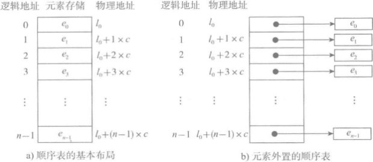
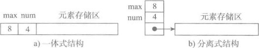
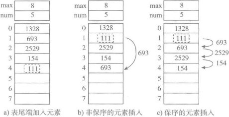

# 顺序表

## 1. 线性表
在程序中经常需要将一组（通常是同为某个类型的）数据元素作为整体管理和使用，需要创建这种元素组，用变量记录它们，传进传出函数等。一组数据中包含的元素个数可能发生变化（可以增加或删除元素）。最简单的解决方案便是将这样一组元素看成一个序列，用元素在序列里的位置和顺序，表示实际应用中的某种有意义的信息，或者表示数据之间的某种关系。

这样的一组序列元素的组织形式，我们可以将其抽象为**线性表**。一个线性表是某类元素的一个集合，还记录着元素之间的一种顺序关系。线性表是最基本的数据结构之一，在实际程序中应用非常广泛，它还经常被用作更复杂的数据结构的实现基础。

根据线性表的实际存储方式，分为两种实现模型：
* **顺序表**。将元素顺序地存放在一块连续的存储区里，元素间的顺序关系由它们的存储顺序自然表示。
* **链表**。将元素存放在通过链接构造起来的一系列存储块中。

这一节我们主要来探讨顺序表。

## 2. 存储方式

图a是顺序表数据存储的基本形式，数据元素本身连续存储，每个元素所占的存储单元大小固定相同，元素的下标是其逻辑地址，而元素存储的物理地址（实际内存地址）可以通过存储区的起始地址Loc (e0)加上逻辑地址（第i个元素）与存储单元大小（c）的乘积计算而得，即：`Loc(ei) = Loc(e0) + c*i`。访问指定元素时无需遍历，通过计算便可获得对应地址，其时间复杂度为O(1)。

如果元素的大小不统一，则须采用图b的元素外置的形式，将实际数据元素另行存储，而顺序表中各单元位置保存对应元素的地址信息（即链接）。由于每个链接所需的存储量相同，通过公式，可以计算出元素链接的存储位置，而后顺着链接找到实际存储的数据元素。注意，图b中的c不再是数据元素的大小，而是存储一个链接地址所需的存储量(通常很小)。图b这样的顺序表也被称为对实际数据索引，这是最简单的索引结构。

## 3. 存储结构
一个顺序表的完整信息包括两部分，一部分是表中的元素集合，另一部分是为实现正确操作而需记录的信息，即有关表的整体情况的信息，包括元素存储区的容量和当前表中已有的元素个数等信息。

图a为一体式结构，存储表信息的单元与元素存储区以连续的方式安排在一块存储区里，两部分数据的整体形成一个完整的顺序表对象。一体式结构整体性强，易于管理。由于数据元素存储区域是表对象的一部分，顺序表创建后，元素存储区就固定了。

图b为分离式结构，表对象里只保存与整个表有关的信息（即容量，元素个数和元素存储首地址），实际数据元素存放在另一个独立的元素存储区里，通过链接与基本表对象关联。

#### 存储区扩充
当顺序表中需要添加新的元素进来时，由于元素存储区地址要保持连续性，所以就需要重新申请更大的存储空间，将现有元素全部迁移到新地址，再加入后来的元素，最后将原元素存储区释放。

一体式结构中扩充后，顺序表地址也随之被改变，而分离器结构中，则只需要将表头中元素存储首地址修改为新的地址即可，顺序表地址不变。这种保持地址不变且容量可以动态扩充的顺序表称为动态顺序表。

存储区扩充有以下两种常用策略:
* 线性扩充。每次扩充增加固定数目的存储位置，如每次扩充增加10个元素位置。其特点为节省空间，但扩充频繁，操作次数多。
* 倍速扩充(推荐)。每次扩充容量加倍，如每次扩充增加一倍存储空间。可以减少操作的次数，但可能会浪费空间资源。是一种以空间换时间的放回寺。

## 4. 常用操作
集合对象最常见的操作就是CRUD，顺序表亦是如此。由于顺序表顺序利用内存空间的特性，其查询和修改操作可直接利用索引定位元素，所以其时间复杂度均为`O(1)`。

顺序表新增元素有两种方式，一种是在尾部新增元素，另一种则是在特定位置新增元素。

如上图所示，在尾部新增元素，直接根据索引定位尾部，加入新元素即可，其时间复杂度为`O(1)`。在特定位置新增元素分为保序和非保序两种方式。保序方式需先根据索引定位，然后将此位置后所有元素全部后移，最后将新的元素插入到之前的位置，如果要在第0个元素处新增，则全部元素需要后移，故而其最坏事件复杂度为`O(n)`。非保序插入的则将指定位置元素移到尾部，然后将新元素插入空出的位置即可，其时间复杂度为`O(1)`。多数情况下，顺序表都是固定元素顺序的，非保序方式使用较少。

顺序表删除元素的过程与新增原理完全相同。时间复杂度分别为，尾部删除`O(1)`,删除特定元素，保序为`O(n)`非保序为`O(1)`。

## 5. Python 顺序表
Python中`list`和`tuple`两种类型均采用顺序表的实现。`tuple`是不可变类型，即不变的顺序表，因此不支持改变其内部状态的任何操作，而其与`list`的性质相同。下面我们主要以`list`为例讲解。

在Python的官方实现中，**`list`就是一种元素外置存储的采用分离式技术实现的动态顺序表**。因此可以使用下标方式访问元素，扩充后地址(`id`)不变。`list`采用保序方式操作元素，所以新增和删除元素后其元素顺序保持不变。

`list`内存使用策略如下。在建立空表(或者很小的表)时，系统直接申请8个元素的存储区；在执行插入操作(`insert`或`append`)时，如果8个存储区满，以4倍倍增扩充，如存储区达到50000的阈值，则改用一倍倍增。