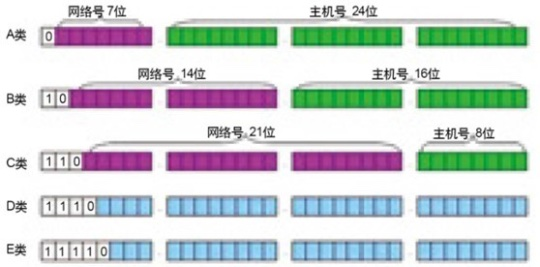
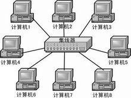
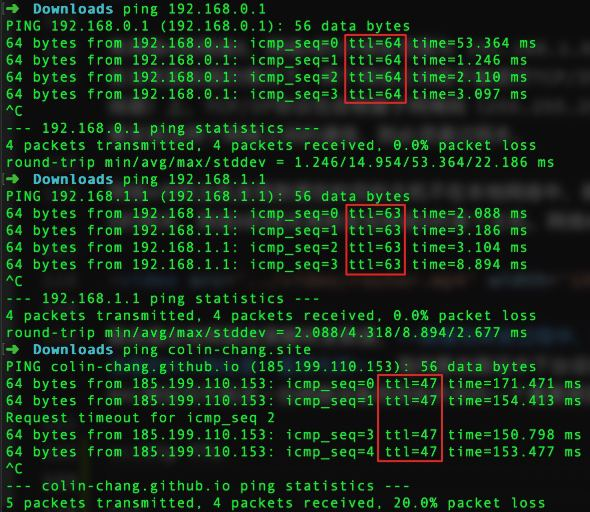

# 网络通信

## 1. TCP/IP
TCP/IP协议（传输控制协议/互联网协议）不是简单的一个协议，而是一组特别的协议，包括：TCP，IP，UDP，ARP等，这些被称为子协议。在这些协议中，最重要、最著名的就是TCP和IP。因此，大部分网络管理员称整个协议族为“TCP/IP”。由于它的简洁、实用，TCP/IP协议已成为建立计算机局域网、广域网的首选协议，已成为事实上的工业标准和国际标准。

计算机网络中，实际应用的网络协议是TCP/IP协议族。TCP/IP包含 链路层/网络层/传输层/应用层 四层。TCP/IP的应用层大体上对应着OSl/RM模型的应用层、表示层和会话层，TCP/IP的网络接口层对应着OSI/RM的数据链路层和物理层，而传输层和网络层在两个模型中对应得很好。

* 链路层

    链路层有时也称作数据链路层或网络接口层，通常包括操作系统中的设备驱动程序和计算机中对应的网络接口卡。它们一起处理与电缆（或其他任何传输媒介）的物理接口细节。把链路层地址和网络层地址联系起来的协议有ARP（Address Resolution Protocol，地址解析协议）和RARP（Reverse Address Resolution Protocol，逆地址解析协议）。
* 网络层

    网络层处理分组在网络中的活动，例如分组的选路。在TCP/IP协议族中，网络层协议包括IP协议（Internet Protocol，网际协议）、ICMP协议（Internet Control Message Protocol，网际控制报文协议）和IGMP协议（Internet Group Management Protocol，网际组管理协议）。
* 传输层

    传输层主要为两台主机上的应用程序提供端到端的通信。在TCP/IP协议族中，有两个互不相同的传输协议：TCP（Transmission Control Protocol，传输控制协议）和UDP（User Datagram Protocol，用户数据报协议）。
* 应用层

    应用层负责处理特定的应用程序细节。几乎各种不同的TCP/IP实现都会提供下面这些通用的应用程序：Telnet远程登录、SMTP、FTP、HTTP等。


<style>#tcpip tr th:first-child,#tcpip tr td:first-child{border-right:3px solid lightblue;}#tcpip tr:nth-child(5),#tcpip tr:nth-child(6),#tcpip tr:nth-child(7){border-top:2px dashed green;}</style>
<table id='tcpip'>
    <tr><th>OSI</th><th colspan='2'>TCP/IP族</th></tr></thead>
    <tr><td>应用层</td><td rowspan='3'>应用层</td><td rowspan='3'>Telnet / SMTP / FTP / HTTP / DNS等</td></tr>
    <tr><td>表示层</td></tr>
    <tr><td>会话层</td></tr>
    <tr><td>传输层</td><td>传输层</td><td>TCP / UDP</td></tr>
    <tr><td>网络层</td><td>网络层</td><td>IP / ICMP / IGMP / ARP /RARP 等</td></tr>
    <tr><td>数据链路层</td><td rowspan='2'>链路层</td><td rowspan='2'>物理网络接口(以太网等)</td></tr>
    <tr><td>物理层</td></tr>
</table>

## 2. 划分子网
IP地址在设计时就考虑到地址分配的层次特点，将每个IP地址都分割成网络号和主机号两部分，以便于IP地址的寻址操作。



IP地址的网络号和主机号各是多少位呢,这就需要通过子网掩码了。子网掩码作用就是将IP分割为网络号和主机号两部分。子网掩码的长度也是32位，从左到右“1”为网络位“0”为主机位。简言之，子网掩码用于划定子网范围。

如IP地址“192.168.1.0”，子网掩码“255.255.255.0”。掩码中前24位均为1即,后8位为0表示，192.168.1.0 是固定网络号，最后可变的8位主机号可以为0,255。最终IP:192.168.1.0，子网掩码:255.255.255.0就表示 192.168.1.0～192.168.1.255的IP地址段。

以上IP地址段，还可以用 192.168.1.0/24 的简化方式表示。 192.168.1.0 为地址段起始地址，24表示掩码中固定不变的位数即网络号。
IP相关的转换可以参阅 [IpMaskConverter](https://github.com/colin-chang/IpMaskConverter)。

**IP地址与子网掩码进行逻辑与运算即可得到网络号**。通过子网掩码我们就可以确定一个IP所属的网络。不难发现主机号全为0即为网络号，主机号全为1，则约定为广播地址。**只有在同一个网络中的设备才能进行通信**。

如果将子网掩码设置过大，也就是说子网范围扩大，那么，根据子网寻径规则，很可能发往和本地主机不在同一子网内的目标主机的数据，会因为错误的判断而认为目标主机是在同一子网内，那么，数据包将在本子网内循环，直到超时并抛弃，使数据不能正确到达目标主机，导致网络传输错误；如果将子网掩码设置得过小，那么就会将本来属于同一子网内的机器之间的通信当做是跨子网传输，数据包都交给缺省网关处理，这样势必增加缺省网关(文章下方有解释)的负担，造成网络效率下降。因此，子网掩码应该根据网络的规模进行设置。如果一个网络的规模不超过254台电脑，采用“255.255.255.0”作为子网掩码就可以了，现在大多数局域网都不会超过这个数字，因此“255.255.255.0”是最常用的IP地址子网掩码；假如在一所大学具有1500多台电脑，这种规模的局域网可以使用“255.255.0.0”。


## 3. 局域网组网
我们知道计算机中使用二进制管理数据，数据在网络传输过程中通过通电和断电两种方式来表示0和1，以此方式进行数据传输。两台设备之间可以直连进行通信，但假若两台以上设备直接互联，会导致网路上通电与断电相互影响，所以两台以上设备组网就需要借助其他网络设备，其中最常见的便是集线器和交换机。

> 推荐使用Cisco Packet Tracer模拟组网和检测网路通讯

### 3.1 集线器(Hub)
集线器是一个工作于物理层的多端口转发器，属于网络基础设备。大多数的时候它用在星型与树型网络拓扑结构中。

集线器发送数据时都是没有针对性的，而是采用广播方式发送。也就是说当它要向某节点发送数据时，不是直接把数据发送到目的节点，而是把数据包发送到与集线器相连的所有节点，这就容易堵塞网络。

由于集线器会把收到的任何数字信号，经过再生或放大，再从集线器的所有端口提交，这会造成信号之间碰撞的机会很大，而且信号也可能被窃听

由于以上问题的存在，集线器已经基本被更为安全高效的交换器所取代。



### 3.2 交换机(Switch)
#### 3.2.1 交换机组网
交换机是工作于数据链路层的网络基础设施，可以为接入交换机的任意两个网络节点提供独享的电信号通路。网络交换机能为子网络中提供更多的连接端口，以便连接更多的计算机。它具有性价比高、高度灵活、相对简单和易于实现等特点。

交换机由集线器升级而来，在集线器功能基础上，提高了数据完整性和正确性，同时具备学习能力，以太网交换机了解每一端口相连设备的MAC地址，并将地址同相应的端口映射起来存放在交换机缓存中的MAC地址表中，当一个数据帧的目的地址在MAC地址表中有映射时，它被转发到连接目的节点的端口而不是所有端口（如该数据帧为广播帧则转发至所有端口）。

在学习之前，交换机第一次进行网络通讯会进行数据广播，同时混存设备MAC地址，之后便可向指定MAC地址的设备提供独享网络通路。

::: tip MAC 地址
MAC（Media Access Control，介质访问控制）地址，或称为MAC位址、硬件地址，用来定义网络设备的位置，MAC集成在网卡中。

由48bit的2进制的数字组成，一般表示为6组(每组2位)16进制数字，如`3c:15:c2:cf:b5:96`。6组数字中每三组位一部分，高位部分`3c:15:c2`为组织唯一标志符，标志设备生产厂家，低位部分`cf:b5:96`则由生产商自由分配。`FF:FF:FF:FF:FF:FF` 为MAC广播地址。

MAC地址是全球唯一不重复的，可以唯一确定一个网络设备。
:::

#### 3.2.2 ICMP/ARP/RARP
网路通讯过程是在不同网络设备之间进行的，而不同网路设备最终是通过MAC地址标志的，所以最终是两个MAC地址之间进行数据传输。

当我们使用的`ping`命令测试网络联通性时，终端会使用ICMP协议发送数据包到指定IP。

第一步需要做的是匹配目标IP的MAC地址，终端会首先检测本地ARP缓存中是否存在IP对应的MAC地址，如果存在则直接发送ICMP包到交换机，交换机转发至目标终端设备，终端设备回复数据包经由交换机发回当前终端设备；如果ARP缓存中不存在IP对应MAC地址，则使用ARP协议发送数据包到交换机，交换机广播ARP包到所有终端，终端收到ARP包后解析包中IP与自身IP是否一致，如果不一致则直接丢弃，如果一致则返回自身MAC地址至交换机转发回当前主机，并缓存MAC地址与IP对应关系，确定目标MAC地址之后会执行前面提到的过程。

<video src='../video/arp.mp4' width='100%' autoplay controls muted></video>

ARP缓存有时效性，过期后会在交换机与终端设备之间重新获取。不难看出ARP协议主要通过广播确定IP对应MAC地址，而RARP协议的功能则是根据MAC地址确定IP地址。

上述`ping`命令执行过程略去了中间部分环节，主要体现ARP和ICMP两个协议的使用过程。

```sh
# 查看本地ARP缓存
arp -a

# 清理本地ARP缓存
arp -d
```

## 4. 跨网络通信
我们知道只有同一个子网中的设备才能通信，而路由器会通过多个网卡分别接入多个子网，子网设置默认网关为本网络中路由器地址。

路由器是连接多个网络的硬件设备，在网络间起网关的作用，是读取每一个数据包中的地址然后决定如何传送的专用智能性的网络设备。在网络通信中，路由器具有判断网络地址以及选择IP路径的作用，可以在多个网络环境中，构建灵活的链接系统，通过不同的数据分组以及介质访问方式对各个子网进行链接。

::: tip 
网关实质上是一个网络通向其他网络的IP地址。**网关的IP地址是具有路由功能的设备的IP地址,即路由器**。
:::

有网络A和网络B，网络A的IP地址范围为 192.168.1.0/24 。网络B的IP地址范围为 192.168.2.0/24。
在没有路由器的情况下，两个网络之间是不能进行TCP/IP通信的，即使是两个网络连接在同一台交换机（或集线器）上，TCP/IP协议也会根据子网掩码（255.255.255.0）判定两个网络中的主机处在不同的网络里。而要实现这两个网络之间的通信，则必须通过网关。

网络A中的主机发现数据包的目的主机不在本地网络中，就把数据包转发给它自己的网关，再由网关转发给网络B的网关，网络B的网关再转发给网络B的某个主机。网络B向网络A转发数据包的过程也是如此。

<video src='../video/router.mp4' width='100%' autoplay controls muted></video>

路由器会按照路由策略转发数据，**数据包转发过程中，目标主机的IP地址是保持不变的，而每路由一步目标设备的MAC地址是一直变化的**，指向路由路径中下台设备的MAC地址。这也是为什么网络设备中IP地址和MAC地址均可标志一台网路设备而同却并存的一个重要原因。

:::tip TTL(Time To Live)

使用`PING`命令测试网络联通性时，有一个TTL字段，该字段指定IP包被路由器丢弃之前允许通过的最大网段数量。TTL是一个8 bit字段,最大值是255，TTL的一个推荐值是64。

TL字段由IP数据包的发送者设置，在IP数据包从源到目的的整个转发路径上，**每经过一个路由器TTL的值减1**。如果在IP包到达目的IP之前，TTL减少为0，路由器将会丢弃收到的TTL=0的IP包并向IP包的发送者发送 ICMP time exceeded消息

TTL的主要作用是避免IP包在网络中的无限循环和收发，节省了网络资源，并能使IP包的发送者能收到告警消息。
:::



## 5. DNS
使用HTTP(S)服务器的IP地址可以直接访问服务器上的网站，但IP地址不容易记忆，通常采用域名来代替IP地址标识站点地址。

域名解析就是域名到IP地址的转换过程。域名的解析工作由DNS服务器完成。简单讲，域名解析协议（DNS）用来把便于人们记忆的主机域名和电子邮件地址映射为计算机易于识别的IP地址。

下面短片模拟了交换机/路由器/服务器较为复杂的组网过程中DNS服务器的配置和使用。

<video src='../video/dns.mp4' width='100%' autoplay controls muted></video>