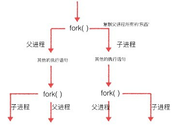

# 多进程

## 1. fork

python的`os`模块中`fork()`可以创建新的进程。

```py {3}
import os

pid = os.fork()
if pid == 0:
    print("I'm subprocess,my pid is %d and my ppid is %d" % (os.getpid(), os.getppid()))
else:
    print("I'm host process,my pid is %d" % os.getpid())
```

* 程序执行到`os.fork()`时，操作系统会创建一个新的进程(子进程)，然后复制父进程的所有信息到子进程中
* 父子进程会从`fork()`分别拿到不同的返回值。父进程中返回值就是子进程的`PID`,子进程返回值是0。父进程可以`fork`多个子进程，所以父进程要记下每个子进程的`PID`

`fork()`比较特殊，它是Unix内核系统函数,在Windows不可用。普通函数调用一次值返回一次，但`fork()`调用一次，返回两次，因为操作系统自动把当前进程(主进程)复制了一份到子进程中，然后分别在父进程和子进程内返回。

* **`fork()`创建的子进程不会因为主进程退出而退出**，子进程会一直执行到自身结束
* 多进程中，每个进程中所有数据（包括全局变量）都各有拥有一份，互不影响，父子进程亦是如此。
* 父子进程执行顺序完全取决于操作系统的调度算法，没有固定顺序。
* 每个进程中都可以多次执行`fork()`创建新的子进程



## 2. Process
`multiprocessing`模块是python跨平台的多进程模块，Windows下也可以使用。`multiprocessing`模块提供了一个`Process`类来管理进程对象，通过`Process`管理进程，**只有当所有子进程执行完成并退出后，主进程才会退出**。

### 2.1 Process
创建一个`Process`实例即是一个子进程。`Process`常用初始化参数如下表：

初始化参数|含义
:-|:-
`target`|进程实例所调用对象
`args`|调用对象的位置参数元组
`kwargs`|调用对象的关键字参数字典
`name`|当前进程实例别名

`Process`常用成员如下表：

成员|作用
:-|:-
`is_alive()`|判断进程实例是否还在执行
`join([timeout])`|等待进程执行结束(或等待多少秒)
`start()`|启动进程实例(创建子进程)
`run()`|若未指定`target`参数，调用`start()`将执行对象的`run()`
`terminate()`|立即终止进程不管任务是否完成
`name`|当前进程别名，默认为Process-N(N为从1开始递增的整数)
`pid`|当前进程`PID`

```py {12,13,15}
from multiprocessing import Process
import os
import time


def process_request(interval):
    print("subprocess's PID is %d and host process's PID is %d " % (os.getpid(), os.getppid()))
    time.sleep(interval)  # 模拟耗时操作


def main():
    pr = Process(target=process_request, args=(5,), name="pr")  # 创建子进程
    pr.start()  # 启动子进程
    print(pr.is_alive())  # 判断pr进程是否在运行
    pr.join()  # 等待pr执行完成后再执行下面代码
    print("%s process finished" % pr.name)


if __name__ == "__main__":
    main()
```

### 2.2 自定义进程封装
前面我们创建一个进程并让其执行一个简单的函数，如果子进程要执行的业务逻辑比较繁杂，必然需要很多变量和其他函数辅助，该如何除处理呢？既然一个进程就是一个`Process`对象，那我们可以考虑将此进程相关的所有内容全部封装到`Process`对象中，自定义一个类继承`Process`并在其中扩展我们需要的属性和方法即可。

```py {6,8}
from multiprocessing import Process
import os
import time


class PRProcess(Process):
    def __init__(self, request):
        super().__init__()  # 务必执行父类初始化方法
        self.__request = request

    def run(self):  # 会被自动调用
        print("subprocess's PID is %d and host process's PID is %d " % (os.getpid(), os.getppid()))
        time.sleep(2)  # 模拟耗时操作
        print("%s processed" % self.__request)


def main():
    pr = PRProcess("request-0")
    pr.start()


if __name__ == "__main__":
    main()
```

## 3. 进程池
当需要密集的进程操作或大量的创建进程时，直接使用`Process`创建进程就显得力不从心了，此时我们可以使用进程池(`Pool`)简单快速且高效的创建管理复用进程。

初始化`Pool`时，可以指定最大进程数。当有新请求时，若`Pool`没满则会创建新进程处理该请求;若`Pool`已满(进程数已经达最大值)，那该请求就会等待，直到`Pool`中有进程执行完毕后再来处理等待中的请求。

`Pool`方法|功能
:-|:-
`apply_async(func[,args[,kwds]])`|异步方式调用`func`
`apply(func[,args[,kwds]])`|同步方式调用`func`。上个进程退出才执行下个
`close()`|关闭`Pool`，使其不再接受新的任务
`terminate()`|立即终止,不管任务是否完成
`join()`|等待`Pool`所有进程执行完成。必须在`close`或`terminate`后使用

使用进程池时，**主进程不会等待`Pool`中进程执行完毕后才退出**，可以使用`join()`方法阻塞等待进程池所有任务执行完毕。

当任务数量大于`Pool`中最大进程数量时，程序并不会阻塞，只是任务需要等待进程池调度进程来执行。

```py {12,14,16,17}
from multiprocessing import Pool
import os
import time


def process_request(request):
    time.sleep(2)  # 模拟耗时操作
    print("%s processed by process %d" % (request, os.getpid()))


def main():
    pool = Pool(3)  # 创建进程池，并指定最大进程数
    for i in range(10):
        pool.apply_async(process_request, ("request-%d" % i,))  # 给进程池分派任务

    pool.close()  # 关闭进程池
    pool.join()  # 等待进程池中所有任务结束
    print("all done")


if __name__ == "__main__":
    main()
```

## 4. 进程间通信
我们可以使用队列实现生产者消费者模式来进行进程间通信。python为多任务提供了三个队列。

* `multiprocessing.Queue()`用于`Process`方式使用进程
* `multiprocessing.Manager().Queue()`用于进程池方式使用进程
* `queue.Queue()`用于[线程](thread.md#_3-2-queue)的队列

三个队列使用方式相同，但**特别需要注意的是三个队列不可混用。**


常用方法|功能
:-|:-
`qsize()`|返回当前队列包含的消息数量
`empty()`|判断队列是否为空
`full()`|判断队列是否已满
`put(item,[block[, timeout]])`|阻塞方式入队item
`get([block[,timeout]])`|阻塞方式出队一个成员
`put_nowait(item)`|非阻塞入队item。`Queue.put(item, False)`
`get_nowait`|非阻塞出队一个成员。相当于`get(False)`

非阻塞方式入队成员，如果队列已满会抛出`Queue.Full`异常。非阻塞出队如果队列为空会抛出`Queue.Empty`异常。

`Process`方式使用进程和队列可以参考[多线程使用队列](thread.md#_3-2-queue),两者非常类似，这里不再赘述，下面我们简单看下进程池使用队列实现进程间通信。


```py {1,11,19,25}
from multiprocessing import Pool, Manager
import os
import time
import random


def produce(queue):
    while True:
        product = random.randint(10, 20)
        print("process-%s produced product-%d\t%s" % (os.getpid(), product, time.ctime()))
        queue.put(product)  # 入队

        time.sleep(random.randint(1, 3))


def consume(queue):
    while True:
        if not queue.empty():
            print("process-%s consumed product-%d\t%s" % (os.getpid(), queue.get(), time.ctime()))  # 出队

        time.sleep(random.randint(1, 3))


def main():
    queue = Manager().Queue()  # 创建队列
    pool = Pool()  # 创建进程池
    for i in range(2):
        pool.apply_async(produce, (queue,))  # 创建2个生产者
    for i in range(3):
        pool.apply_async(consume, (queue,))  # 创建3个消费者

    pool.close()
    pool.join()


if __name__ == "__main__":
    main()
```