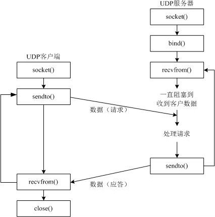
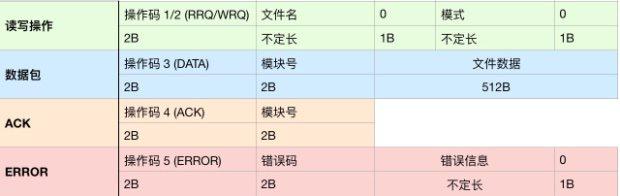

# Socket

## 1. 网络基础
### 1.1 TCP/IP 协议族
TCP/IP协议（传输控制协议/互联网协议）不是简单的一个协议，而是一组特别的协议，包括：TCP，IP，UDP，ARP等，这些被称为子协议。在这些协议中，最重要、最著名的就是TCP和IP。因此，大部分网络管理员称整个协议族为“TCP/IP”。由于它的简洁、实用，TCP/IP协议已成为建立计算机局域网、广域网的首选协议，已成为事实上的工业标准和国际标准。

计算机网络中，实际应用的网络协议是TCP/IP协议族。TCP/IP包含 链路层/网络层/传输层/应用层 四层。TCP/IP的应用层大体上对应着OSl/RM模型的应用层、表示层和会话层，TCP/IP的网络接口层对应着OSI/RM的数据链路层和物理层，而传输层和网络层在两个模型中对应得很好。

* 链路层

    链路层有时也称作数据链路层或网络接口层，通常包括操作系统中的设备驱动程序和计算机中对应的网络接口卡。它们一起处理与电缆（或其他任何传输媒介）的物理接口细节。把链路层地址和网络层地址联系起来的协议有ARP（Address Resolution Protocol，地址解析协议）和RARP（Reverse Address Resolution Protocol，逆地址解析协议）。
* 网络层

    网络层处理分组在网络中的活动，例如分组的选路。在TCP/IP协议族中，网络层协议包括IP协议（Internet Protocol，网际协议）、ICMP协议（Internet Control Message Protocol，网际控制报文协议）和IGMP协议（Internet Group Management Protocol，网际组管理协议）。
* 传输层

    传输层主要为两台主机上的应用程序提供端到端的通信。在TCP/IP协议族中，有两个互不相同的传输协议：TCP（Transmission Control Protocol，传输控制协议）和UDP（User Datagram Protocol，用户数据报协议）。
* 应用层

    应用层负责处理特定的应用程序细节。几乎各种不同的TCP/IP实现都会提供下面这些通用的应用程序：Telnet远程登录、SMTP、FTP、HTTP等。


<style>#tcpip tr th:first-child,#tcpip tr td:first-child{border-right:3px solid lightblue;}#tcpip tr:nth-child(5),#tcpip tr:nth-child(6),#tcpip tr:nth-child(7){border-top:2px dashed green;}</style>
<table id='tcpip'>
    <tr><th>OSI</th><th colspan='2'>TCP/IP族</th></tr></thead>
    <tr><td>应用层</td><td rowspan='3'>应用层</td><td rowspan='3'>Telnet / SMTP / FTP / HTTP / DNS等</td></tr>
    <tr><td>表示层</td></tr>
    <tr><td>会话层</td></tr>
    <tr><td>传输层</td><td>传输层</td><td>TCP / UDP</td></tr>
    <tr><td>网络层</td><td>网络层</td><td>IP / ICMP / IGMP等</td></tr>
    <tr><td>数据链路层</td><td rowspan='2'>链路层</td><td rowspan='2'>物理网络接口(以太网等)</td></tr>
    <tr><td>物理层</td></tr>
</table>

### 1.2 子网掩码
IP地址在设计时就考虑到地址分配的层次特点，将每个IP地址都分割成网络号和主机号两部分，以便于IP地址的寻址操作。


IP地址的网络号和主机号各是多少位呢,这就需要通过子网掩码了。子网掩码作用就是将IP分割为网络号和主机号两部分。子网掩码的长度也是32位，从左到右“1”为网络位“0”为主机位。简言之，子网掩码用于划定子网范围。

如IP地址“192.168.1.1”，子网掩码“255.255.255.0”。掩码中前24位均为1即,后8位为0表示，192.168.1.0 是固定网络号，最后可变的8位主机号可以位0,255。最终IP:192.168.1.1，子网掩码:255,255,255,0就表示 192.168.1.0～192.168.1.255的IP地址段。

以上IP地址段，还可以用 192.168.1.0/24 的简化方式表示。 192.168.1.0为地址段起始地址，24表示掩码中固定不变的位数即网络号。
IP相关的转换可以参阅 [IpMaskConverter](https://github.com/colin-chang/IpMaskConverter)。

主机号全为0，表示网络号，主机号全为1，表示网络广播。

如果将子网掩码设置过大，也就是说子网范围扩大，那么，根据子网寻径规则，很可能发往和本地主机不在同一子网内的目标主机的数据，会因为错误的判断而认为目标主机是在同一子网内，那么，数据包将在本子网内循环，直到超时并抛弃，使数据不能正确到达目标主机，导致网络传输错误；如果将子网掩码设置得过小，那么就会将本来属于同一子网内的机器之间的通信当做是跨子网传输，数据包都交给缺省网关处理，这样势必增加缺省网关(文章下方有解释)的负担，造成网络效率下降。因此，子网掩码应该根据网络的规模进行设置。如果一个网络的规模不超过254台电脑，采用“255.255.255.0”作为子网掩码就可以了，现在大多数局域网都不会超过这个数字，因此“255.255.255.0”是最常用的IP地址子网掩码；假如在一所大学具有1500多台电脑，这种规模的局域网可以使用“255.255.0.0”。

## 2. Socket 简介
Socket是进程间通信的一种方式，它能实现不同主机间的进程间通信，我们网络上各种各样的服务大多都是基于Socket来完成通信的。

在python中使用`socket`非常简单,`socket`模块中封装了`socket`相关对象。


* python中`socket`对象为全双工通信，可以同时收发消息，即可作为客户端也可做服务端。
* 每次创建`socket`对象都会使用随机的端口号。一般情况下，服务器需要绑定端口让客户端能够正确发送到此进程。

```py
from socket import *

tcp_socket = socket(AF_INET, SOCK_STREAM)  # 创建跨主机TCP socket
udp_socket = socket(AF_INET, SOCK_DGRAM)  # 创建跨主机UDP socket
```
* `family`：可选`AF_INET`(跨主机进程通信)或`AF_UNIX`(本机进程通信)
* `type`：`socket`类型可选`SOCK_STREAM`(流式套接字，主要用于TCP协议)或者`SOCK_DGRAM`(数据报套接字，主要用于UDP协议)

## 3. UDP
### 3.1 UDP 协议
UDP为用户数据报协议，是一个无连接的面向数据报的运输层协议。UDP不提供可靠性，它只是把应用程序传给IP层的数据报发送出去，但是并不能保证它们能到达目的地。由于UDP在传输数据报前不用在客户和服务器之间建立一个连接，且没有超时重发等机制，故而传输速度很快。

UDP数据包括目的端口号和源端口号信息，由于通讯不需要连接，所以可以实现广播发送。UDP传输数据时有大小限制，每个被传输的数据报必须限定在64KB之内。UDP是一个不可靠的协议，发送方所发送的数据报并不一定以相同的次序到达接收方。

UDP一般用于多点通信和实时的数据业务，比如视频会议系统,语音广播,DNS等。



UDP的网络通信过程如上图所示。客户端发送消息是消息被逐层组包的一个过程。客户端应用层传输字符串消息Hello，消息到达传输层后附加目标端口等信息，到达网络层后则会附加目标IP地址等信息，到达链路层后会附加目标MAC地址等信息，然后数据包进入物理网络开始传输。

数据经由网络路由到达服务端后，服务端则会经历一个与客户端过程相反的解包过程。数据包首先到达链路层，链路层判断数据包MAC地址是否为当前设备，如果不是则直接丢弃数据包，否则进入网络层，网络层会判断数据包IP地址与当前IP是否匹配，如果不匹配则丢弃，否则进入传输层，传输层判断数据包断后与当前程序绑定端口是否一致，不一致则丢弃，否则进入应用层。应用层最终接收到的数据就是客户端最初发送的数据。

综合来看，UDP的网络通讯会经理客户端组包，服务端解包的两个过程，类似于电商网购的过程，卖家需要组包商品然后通过物流网络发货，买家收到货物后验证信息是否正确并逐层拆去包装最终拿到商品。

### 3.2 UDP Socket
#### 3.2.1 基本用法
常用方法|功能
:-|:-
`sendto(data,('hostaddr',port))`|发送数据。`data`如果是字符串需要进行编码
`recvfrom(buffersize)`|接收数据。返回值为`(data, address info)`
`bind(('hostaddr',port))`|绑定地址。`hostaddr`为空则会绑定本机所有可用地址(多网卡)
`close()`|关闭连接

```py {4,7,8,12,13}
from socket import *

# 客户端
udp_client = socket(AF_INET, SOCK_DGRAM)  # 创建跨主机UDP socket
msg = "测试消息".encode("gb2312")  # 处理编码问题
# msg = b"test message"
udp_client.sendto(msg, ("192.168.0.200", 8080))  # 发送数据
udp_client.close()

# 服务器
udp_server = socket(AF_INET, SOCK_DGRAM)
udp_server.bind(('', 8080))  # ''表示绑定本机所有可用IP，8080为绑定端口
msg,(host,port) = udp_client.recvfrom(1024)  # 阻塞等待接收消息。1024表示每次接收最大字节数
print(msg.decode("gb2312"))
udp_server.close()
```

下面是UDP两个简单案例。

##### 1）echo服务器
接收到客户端消息并原样原路返回消息的服务端称为echo服务器，一般用来测试网络是否可用。

```py
from socket import *

def main():
    echo = socket(AF_INET, SOCK_DGRAM)
    echo.bind(('', 8080))
    while True:
        msg, src = echo.recvfrom(1024)
        echo.sendto(msg, src)
        print("received %s from %s" % (msg, src))

    echo.close()


if __name__ == "__main__":
    main()
```

##### 2) 即时聊天软件
```py
from socket import *
from threading import Thread
from time import ctime


def receive():
    while True:
        msg, (host, port) = skt.recvfrom(1024)
        print("%s:%d %s\t%s" % (host, port, ctime(), msg.decode()))


def send(ip, port):
    while True:
        msg = input().encode()
        skt.sendto(msg, (ip, port))


skt: socket = None


def main():
    global skt
    skt = socket(AF_INET, SOCK_DGRAM)
    skt.bind(('', 8080))

    ip = input("target ip:")
    port = int(input("target port:"))

    Thread(target=receive).start()
    Thread(target=send, args=(ip, port)).start()


if __name__ == '__main__':
    main()
```

#### 3.2.2 UDP 广播

UDP通讯中，我们想广播地址发送的数据，网络交换机会自动广播到当前网络中的所有地址。如局域网通讯软件，一个用户上线之后就可以广播上线信息，这样所有在线用户都可以收到他的上线通知。

局域网中，主机号全部为1的地址为广播地址。如 192.168.0.0/24 网络广播地址为 192.168.0.255; 192.168.0.0/16 网络广播地址为 192.168.255.255。

python中使用UDP广播需要做简单配置，然后发送消息到广播地址即可，`<broadcast>`可以自动确定当前网络广播地址。

```py {4,5}
from socket import *

bd = socket(AF_INET, SOCK_DGRAM)
bd.setsockopt(SOL_SOCKET, SO_BROADCAST, 1)  # 设置广播
bd.sendto("test broadcast".encode(), ("<broadcast>", 8080))  # 发送到广播地址
bd.close()
```

### 3.3 TFTP
#### 3.3.1 TFTP 简介
TFTP（Trivial File Transfer Protocol,简单文件传输协议）是一个基于UDP协议的简单的、低开销的文件传输协议。使用端口号为69。TFTP常用于小容量存储的服务器，如路由器等。

从网络服务器下载文件时，首先会在按照一定规则在本地创建一个空文件。服务器则会打开文件并逐次向客户端发送文件字节流，客户端接收到后将其写入之前创建的文件中，如此往复直到文件内容传输完成，即文件下载完成。文件上传过程与之类似，只是在服务端创建文件和传输方向不同。



TFTP传输的数据包格式固定，如上图所示。传输中有三种模式：netascii，这是8位的ASCII码形式，另一种是octet，这是8位源数据类型；最后一种mail已经不再支持，它将返回的数据直接返回给用户而不是保存为文件。

客户端第一次向服务器发送1(下载)/2(上传)操作码，同时请求文件。如果服务器找到文件会立即打开文件并通过TFTP协议发送给客户端。如果文件尺寸较大，服务器会分多次发送每次512B，为了让客户端对接收到的数据进行排序，在服务器发送数据的时候会多发2B数据，用来存放序号，序号是从1开始。

因为udp的数据包不安全，即发送方发送是否成功不能确定，所以TFTP协议中规定，为了让服务器知道客户端已经接收到了刚刚发送的那个数据包，所以当客户端接收到一个数据包的时候需要向服务器进行发送确认信息，即发送收到了，这样的包成为ACK(应答包)。

客户端接收到的数据小于516B(2B操作码+2B序号+512B数据),表示文件传输完成。如果最后一个数据包文件内容刚好512B，TFTP服务器会再发一次一个文件数据长度为0的包。

TFTP服务器默认绑定端口为69，但开始文件内容传输后每次使用动态端口。

> [TFTP Server on mac](/it/tftp)

#### 3.3.2 TFTP 客户端开发
#### 1）大端/小端

内存单位的地址是有高低位不同顺序的。一个多字节对象也是有高低位的，如0x1122,11是高位,22是低位。多字节的内存对象一般会占用多个内存单位，此时对象在内存中的存储顺序就有两种选择。如过，对象低位存储使用低位内存，称为小端。反之，低位对象使用高位内存则称为大端。

一般个人PC操作系统内存多使用小端存储方式，而大型服务器系统多使用大端。**网络数据传输必须使用大端。**


#### 2） 字节对象 组包/拆包
前面我们了解到，TFTP的传输的数据包(字节对象)是有格式的，不能直接传输字符串。我们需要按照其格式组包和拆包。不只TFTP，大多数的网络数据传输都对数据包要特定格式要求。

python的`struct`模块提供了`pack()`和`unpack()`两个函数分别用于组包和拆包。假定我们要组装一个数据包下载TFTP服务器的`test.txt`文件，可以按如下方式组包。
```py {3}
from struct import pack

pack("!H8sb5sb",1,"test.txt",0,"octet",0)

"""
pack函数第一个参数为数据包格式，后面各参数填充各位置

1. '!'开头表示此为网络数据包,使用大端组织数据
2. 'H'表示整数占位2B，第二个参数1会占用2B
3. 's'表示字符占位1B，8s表示第三个参数test.txt占用8B
4. 'b'表示整数占位1B，第四个参数0占用1B
5. '5sb'分别为最后octet和0两个参数占位5B和1B
"""
```

#### 3）TFTP 客户端
下面我们使用python来简单完成一个TFTP客户端。

```py
from socket import *
from struct import pack, unpack


def download(file):
    rrq = pack(("!H%dsb5sb" % len(file)), 1, file.encode(), 0, b"octet", 0)  # 构建下载请求
    udp.sendto(rrq, (ip, 69))  # 发送下载文件请求

    p_num = 0  # 本地模块号
    recvFile = None

    while True:
        recvData, recvAddr = udp.recvfrom(1024)
        recvDataLen = len(recvData)
        cmd_num = unpack("!HH", recvData[:4])
        cmd = cmd_num[0]  # 操作码
        current_num = cmd_num[1]  # 模块号

        if cmd == 3:  # 数据包
            if current_num == 1:  # 如果是第一次接收到数据，那么就创建文件
                recvFile = open(file, "ab")

            if p_num + 1 == current_num:  # 校验模块号
                recvFile.write(recvData[4:])
                p_num += 1
                print('第(%d)次接收到数据 %d byte(s)' % (p_num, recvDataLen))

                ack = pack("!HH", 4, p_num)
                udp.sendto(ack, recvAddr)

            if recvDataLen < 516:  # 判断是否完成
                recvFile.close()
                print('文件下载成功')
                break

        elif cmd == 5:  # 错误应答
            (error_msg,) = unpack(("!%ds" % (recvDataLen - 4)), recvData[4:recvDataLen])
            print("error occured at num-%d.error message:%s" % (current_num, error_msg.decode()))
            break


def upload(file):
    wrq = pack(("!H%dsb5sb" % len(file)), 2, file.encode(), 0, b"octet", 0)  # 构建上传请求
    udp.sendto(wrq, (ip, 69))  # 发送下载上传请求

    p_num = 1  # 本地模块号
    sendFile = None

    while True:
        recvData, recvAddr = udp.recvfrom(1024)
        recvDataLen = len(recvData)
        cmd_num = unpack("!HH", recvData[:4])
        cmd = cmd_num[0]  # 操作码
        current_num = cmd_num[1]  # 模块号

        if cmd == 4:  # ACK
            if current_num == 0:  # 如果是第一次，那么就打开文件
                sendFile = open(file, "rb")

            if p_num - 1 == current_num:  # 校验模块号
                data = sendFile.read(512)  # 读取 512 byte数据

                if len(data) <= 0:  # 判断文件是否读取完成
                    sendFile.close()
                    print("文件上传完成...")
                    break

                sendData = pack(b"!HH512s", 3, p_num, data)
                udp.sendto(sendData, recvAddr)  # 打包发送数据

                print("第(%d)次数据已发送 %d byte(s)" % (p_num, len(sendData)))
                p_num += 1

        elif cmd == 5:  # 错误应答
            (error_msg,) = unpack(("!%ds" % (recvDataLen - 4)), recvData[4:recvDataLen])
            print("error occured at num-%d.error message:%s" % (current_num, error_msg.decode()))
            break


ip = ''
udp = None


def main():
    global ip, udp

    ip = input("please type the hostname of TFTP server:\n")
    udp = socket(AF_INET, SOCK_DGRAM)  # 创建udp套接字

    while True:
        act = int(input("please choose what to do?\n1:download\n2:upload\n3:quit\n"))
        if act == 1:
            file = input("type the name of the file you wanna download...\n")
            download(file)
        elif act == 2:
            file = input("type the name of the file you wanna upload...\n")
            upload(file)
        elif act == 3:
            break

    udp.close()


if __name__ == '__main__':
    main()
```