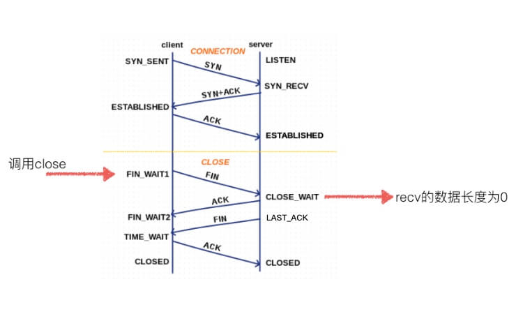
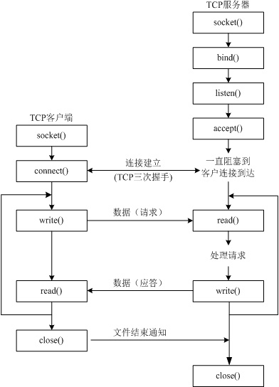
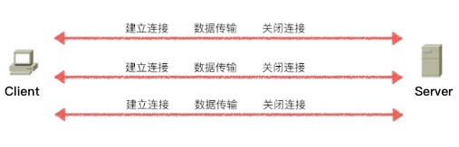
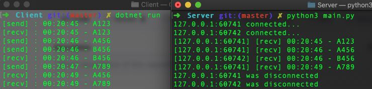

# TCP

传输控制协议（TCP，Transmission Control Protocol）是一种面向连接的、可靠的、基于字节流的传输层通信协议。TCP是为了在不可靠的互联网络上提供可靠的端到端字节流而专门设计的一个传输协议。

## 1. 三次握手
TCP使用三次握手协议建立连接。当主动方发出SYN连接请求后，等待对方回答SYN+ACK，并最终对对方的 SYN 执行 ACK 确认。

TCP三次握手的过程如下：
* (1) 客户端发送SYN（SEQ=x）报文给服务器端，进入SYN_SEND状态。
* (2) 服务器端收到SYN报文，回应一个SYN （SEQ=y）ACK（ACK=x+1）报文，进入SYN_RECV状态。
* (3) 客户端收到服务器端的SYN报文，回应一个ACK（ACK=y+1）报文，进入Established状态。

TCP 标志位|含义
:-|:-
URG | 紧急
ACK | 确认，使得确认号有效。
PSH | 发送数据
RST | 重置连接
SYN | 同步(建立连接)
FIN | 终止。发送方已经结束向对方发送数据。

TCP 标志位为6bit，从左至右分别为 `URG / ACK / PSH / RST / SYN / FIN`。如`0b000010`表示SYN，`0b010000`表示ACK。

## 2. 四次挥手


由于TCP连接是全双工的，因此每个方向都必须单独进行关闭。这原则是当一方完成它的数据发送任务后就能发送一个FIN来终止这个方向的连接。收到一个 FIN只意味着这一方向上没有数据流动，一个TCP连接在收到一个FIN后仍能发送数据。首先进行关闭的一方将执行主动关闭，而另一方执行被动关闭。

TCP四次挥手过程如下：
* (1) TCP客户端发送一个FIN，用来关闭客户到服务器的数据传送。
* (2) 服务器收到这个FIN，它发回一个ACK，确认序号为收到的序号加1。和SYN一样，一个FIN将占用一个序号。
* (3) 服务器关闭客户端的连接，发送一个FIN给客户端。
* (4) 客户端发回ACK报文确认，并将确认序号设置为收到序号加1。

## 3. 2MSL
MSL(Maximum Segment Lifetime) 是报文最大生存时间，即报文在网络上存在的最长时间，超过这个时间报文将被丢弃。MSL在不同操作系统中市场也不尽相同。

Platform|MSL
:-|:-
Windows|120s
Linux|60s
Unix|30s

2MSL即两倍的MSL，TCP的TIME_WAIT状态也称为2MSL等待状态，当TCP的一端发起主动关闭，前第三次挥手完成后发送了第四次握手的ACK包后就进入了TIME_WAIT状态，如果出现服务端没有收到最后一次ACK确认的情况，服务端会在超时后重发第三次挥手的FIN包，经历来回数据包传输，所以客户端必须在此状态上停留两倍的MSL时间。客户端接到重发的FIN包后可以再发一个ACK应答包。

在TIME_WAIT状态时两端的端口不能使用，要等到2MSL时间结束才可继续使用。实际应用中可以通过设置`SO_REUSEADDR`选项达到不必等待2MSL时间结束再使用此端口。

```py
from socket import *

tcp = socket(AF_INET, SOCK_STREAM)

"""
SOL_SOCKET -> 设置级别(Socket Option Level)为SOCKET
SO_REUSEADDR -> 设置地址重用选项(Socket Option Reuse Address)
1 -> 
"""
tcp.setsockopt(SOL_SOCKET, SO_REUSEADDR, 1)  # Socket地址重用  不必等待2MSL再使用当前地址
```

## 4. TCP Socket
TCP是一种面向连接的单播协议，在发送数据前，通信双方必须在彼此间建立一条连接。由于需要比较复杂的过程建立连接，TCP需要耗费比UDP更多的资源，且速度略慢于UDP。



基本函数|功能
:-|:-
`listen()`|TCP服务端启动监听
`accept()`|TCP服务器接受客户端连接并创建通信socket
`connect(('hostaddr',port))`|TCP客户端连接服务端
`recv(buffersize)`|接收数据。返回值为(data, address info)
`send()`|发送数据

```py {6,7,9,11,19}
from socket import *

# 服务端
tcp_server = socket(AF_INET, SOCK_STREAM)  # 创建tcp socket
tcp_server.bind(('', 5678))  # 服务端绑定端口
tcp_server.listen()  # 开启监听客户端连接。阻塞程序
com_socket, (ip, port) = tcp_server.accept()  # 接受客户端连接并创建返回一个专门与之通信的socket

msg = com_socket.recv(1024)  # 通信socket接收客户端数据
print("%s:%d - %s" % (ip, port, msg.decode()))
com_socket.send("test message from tcp server".encode())  # 通信socket发送数据到客户端

com_socket.close()  # 关闭通信socket，断开客户端连接。如果需要与之再次通信，需要客户端重新连接
tcp_server.close()  # 关闭服务端socket，无法再监听客户端连接


# 客户端
tcp_client = socket(AF_INET, SOCK_STREAM)  # 创建tcp socket
tcp_client.connect(('192.168.0.223', 5678))  # 连接tcp服务端
tcp_client.send("test message from tcp client".encode())  # 发送消息给服务端
msg = tcp_client.recv(1024)  # 接收服务端消息。阻塞程序
print(msg.decode())
tcp_client.close()
```

当一个连接被建立或被终止时，交换的报文段只包含TCP头部，而没有数据。也就是说如果接收到的客户端数据长度为0，则意味着客户端断开连接。

## 5. 长连接与短连接

### 5.1 长短连接简介
TCP在真正的读写操作之前，server与client之间会通过三次握手建立一个连接，当读写操作完成后，双方不再需要这个连接时会经历四次挥手释放这个连接，每次连接都会有一定的资源和时间消耗。

在建立一次TCP连接之后完成一次数据传输工作后立即关闭连接，这种连接使用方式称为短链接，而连接建立后进行一次数据传输完成后，保持连接不关闭，直接进行后续数据操作直到完成后关闭连接，这种方式则称为长连接。



短连接对于服务器来说管理较为简单，存在的连接都是有用的连接，不需要额外的控制手段。但客户请求频繁，将在TCP的建立和关闭操作上浪费时间和带宽。多数情况下HTTP请求使用短链接的情况居多，一次请求完毕后连接即被释放，故而HTTP是无状态的。


长连接可以省去较多的TCP建立和关闭的操作，减少浪费，节约时间。但可能存在大量闲置连接不关闭，甚至恶意连接，造成资源浪费。可以以客户端机器为颗粒度，限制每个客户端的最大长连接数。通常情况下数据库连接多使用长连接。

### 5.2 服务器连接管理

当TCP客户端与服务端完成第一次握手但尚未建立连接时，服务端会将此客户端加入到半连接队列，在三次握手后连接建立，服务端会将客户端从半连接队列已到已连接队列中。

半连接队里与已连接队列中客户端的总和称为TCP服务器最大连接数，即同一时间TCP服务器可以接收的最多客户端连接数。这个数值就是`socket.listen(backlog)`中`backlog`设定的值。需要注意的是，**Linux会忽略用户设置而由系统决定最大连接数**。

TCP服务器会为每个客户端连接创建一个专属Socket对象负责与此客户端进行通信。TCP服务端以连接为单位提供服务。所有客户端连接都被维护在连接队列当中，不同连接之间一般是并行执行，而单个连接内部则是串行执行。

### 5.3 共享连接
单客户端连接在服务端是串行执行，这也就意味着单个客户端内部，多任务之间共享一个连接对象时，即便并发请求也会被服务端串行依次处理。如果某此请求执行耗时任务，之后的请求就会等待，客户端在2MSL内没有收到ACK数据包就会执行重发，直到耗时任务行完毕后才会执行后续请求。因此，客户端程序中多任务共享单个连接与单任务执行并无分别。

我们可以通过以下示例来验证刚才的结论。
```py
from gevent import monkey, socket
from gevent import spawn, sleep
import time

monkey.patch_all()
sockets = []


def process_request(client, addr):
    while True:
        data = client.recv(1024)
        if data:
            print("[%s:%d] [recv] %s - %s " % (addr[0], addr[1], time.ctime()[-13:-5], data.decode()))
            if data.decode() == "A456":
                sleep(3)  # 模拟耗时任务
            client.send(data)
        else:
            client.close()
            sockets.remove(client)
            print("%s:%d was disconnected" % addr)
            break


def main():
    tcp = socket.socket()
    tcp.bind(('', 8086))
    tcp.listen()
    tcp.setsockopt(socket.SOL_SOCKET, socket.SO_REUSEADDR, 1)
    sockets.append(tcp)

    try:
        while True:
            client, addr = tcp.accept()
            sockets.append(client)
            print("%s:%d connected..." % addr)

            spawn(process_request, client, addr)
    except:
        pass
    finally:
        for sock in sockets:
            sock.close()
        sockets.clear()


if __name__ == '__main__':
    main()
```

为了避免CPython中[GIL](thread.md#_4-全局解释器锁-gil)伪多线程的影响，这里我们使用.Net Core来实现多任务TCP客户端。
```csharp
using System;
using System.Text;
using System.Net;
using System.Net.Sockets;
using System.Threading;

namespace TcpClient
{
    class Program
    {
        static void Main(string[] args)
        {
            var addr = new IPEndPoint(IPAddress.Parse("127.0.0.1"), 8086);
            var connA = new Socket(AddressFamily.InterNetwork, SocketType.Stream, ProtocolType.Tcp);
            connA.Connect(addr);

            var connB = new Socket(AddressFamily.InterNetwork, SocketType.Stream, ProtocolType.Tcp);
            connB.Connect(addr);

            TestServer(connA, "A123");
            Thread.Sleep(1000);
            TestServer(connA, "A456"); //耗时任务
            TestServer(connB, "B456");
            Thread.Sleep(1000);
            TestServer(connA, "A789");
            Console.ReadKey();
        }

        private static void TestServer(Socket conn, string msg)
        {
            new Thread(() =>
            {
                conn.Send(Encoding.UTF8.GetBytes(msg));
                Console.WriteLine($"[send] : {DateTime.Now.ToString("HH:mm:ss")} - {msg}");
                var byteData = new byte[1024];
                var length = conn.Receive(byteData);
                if (length > 0)
                    Console.WriteLine($"[recv] : {DateTime.Now.ToString("HH:mm:ss")} - {Encoding.UTF8.GetString(byteData)}");
            }){IsBackground = true}.Start();
        }
    }
}
```


> 以上案例代码共享在[Github](https://github.com/colin-chang/LongConnectionExploration)，有兴趣的读者可以自行测试。

### 5.4 数据库连接池

数据库连接是一个很好案例,实际生产环境中，建立和释放数据库连接都需要耗费一定时间，因此数据连接属于比较珍贵的资源。如果每次客户端请求都新建立一个数据库连接，不仅耗费时间、资源更会对数据库造成压力，数据库能承受的并发连接访问是有限的。但是客户端内多任务共享一个连接又会相互影响，数据库连接池就是为了解决这个问题。

为了避免客户端共享连接造成多任务间相互干扰，我们就需要为每个任务分配不同的数据库连接，而多数任务都是简单短促地执行完成，待任务完成后，我们不关闭数据库连接，而是将其放入一个共享队列中，待到其他任务需要申请数据库连接时，程序就可以直接到共享队列中快速获取一个连额使用而不需再经历三次握手重新建立新的连接，我们称这个共享队列为数据库连接池。

不同的开发平台中对关系型数据库和非关系型数据库都有其各自的对数据库连接池实现和应用。以.Net平台为例，访问关系型数据库完成后调用`IDbConnection`对象的`Dispose()`时(多通过`using`关键字自动实现)会释放`IDbConnection`对象并将其占用的数据库连接归还到连接池中。在非关系型数据库中也有对数据库连接池的应用，如[MongoDB连接池](https://architecture.colinchang.net/nosql/mongo.html#_8-2-mongo-连接池),在`Mongo Driver`中提供的`MongoClient`对象本身就实现了一个线程安全的连接池。以下是来自其官方的阐述。
 
> Note: The Mongo object instance actually represents a pool of connections to the database; you will only need one object of class Mongo even with multiple threads. See the concurrency doc page for more information.The Mongo class is designed to be thread safe and shared among threads. Typically you create only 1 instance for a given DB cluster and use it across your app. 

## 6. 多任务TCP服务器
默认情况下Socket通信采用的是同步阻塞IO模型。这种情况下服务器只能同时为一个客户端服务。如果要TCP服务器同时为多客户单同时服务，最简单可以使用多进程、多线程或协程实现。除此之外，我们还可以使用非阻塞IO模型和IO多路复用模型实现，而这些模型都是单线程的。

我们可以参考以下代码测试多客户端同时连接TCP服务器。

```py
from socket import *
import random
import time

g_socketList = []
for i in range(5):
    s = socket(AF_INET, SOCK_STREAM)
    s.connect(('127.0.0.1', 8088))
    g_socketList.append(s)

while True:
    for s in g_socketList:
        s.send(str(random.randint(0, 100)).encode())

    time.sleep(1)
```

### 6.1 协程
与多线程用法类似，将会阻塞程序的耗时操作交由[协程](coroutine.md#_4-gevent)执行，以实现多任务，同时为多客户端服务。

```py {1,3,4,35}
from gevent import monkey, socket

monkey.patch_all()
from gevent import spawn

sockets = []  # 记录socket对象


def process_request(client, info):
    ip, port = info
    while True:
        data = client.recv(1024)
        if data:
            print("%s:%d - %s" % (ip, port, data.decode()))
        else:
            client.close()
            sockets.remove(client)
            print("%s:%d was disconnected" % info)
            break


def main():
    tcp = socket.socket()  # 必须使用gevent包装的socket模块
    tcp.bind(('', 8088))
    tcp.listen()
    tcp.setsockopt(socket.SOL_SOCKET, socket.SO_REUSEADDR, 1)
    sockets.append(tcp)

    try:
        while True:
            client, addr = tcp.accept()
            sockets.append(client)
            print("%s:%d connected..." % addr)

            spawn(process_request, client, addr)  # 创建协程为客户端服务
    except:
        pass
    finally:
        for sock in sockets:
            sock.close()
        sockets.clear()


if __name__ == '__main__':
    main()
```

### 6.2 非阻塞IO模型
除了传统的阻塞IO模型，我们还可以设置Socket为非阻塞模式。非阻塞模式下，服务端监听和客户端接收消息都不再阻塞程序。

Python中使用非阻塞的socket,TCP服务端执行`accept()`时如果客户端没有`connect()`会抛出`OSError`，`recv()`则会抛出`BlockingIOError`需要开发者捕获异常。

下面是一个用非阻塞IO模型实现的单线程仿多任务案例。

```py {11,17}
from socket import *

clients = []


def main():
    tcp = socket(AF_INET, SOCK_STREAM)
    tcp.bind(('', 8088))
    tcp.setsockopt(SOL_SOCKET, SO_REUSEADDR, 1)
    tcp.listen()
    tcp.setblocking(False)  # 设置socket为非阻塞模式

    try:
        while True:
            try:  # 非阻塞模式执行accept()时如果客户端没有connect()会抛出OSError
                client, addr = tcp.accept()
                client.setblocking(False)  # 设置通讯socket为非阻塞模式
                clients.append((client, addr))
                print("%s:%d connected..." % addr)
            except:
                pass

            disconnected_clients = []  # 记录已断开的客户端
            for client, (ip, port) in clients:
                try:
                    data = client.recv(1024)
                    if data:
                        print("%s:%d - %s" % (ip, port, data.decode()))
                    else:  # 接收到客户端数据长度为0，表示客户端关闭连接
                        client.close()  # 关闭为客户端服务的socket
                        disconnected_clients.append((client, (ip, port)))
                        print("%s:%d was disconnected" % (ip, port))
                except:
                    pass

            for client in disconnected_clients:  # 删除已断开连接
                clients.remove(client)
            disconnected_clients.clear()

    except:
        pass
    finally:
        tcp.close()
        for sock in clients:
            sock.close()
        clients.clear()


if __name__ == '__main__':
    main()
```

案例中使用了非阻塞的socket,`accept()`和`recv()`都不会阻塞程序，这样我们就可以通过单任务串行实现先检查是否有新客户端连接，然后再遍历已连接客户端接收数据，当客户端连接较少时，遍历已连接客户端接收消息耗时非常短，感觉上去基本与多任务效果无异。

### 6.3 IO多路复用模型
传统多进程或多线程中一个IO流就会开启一个进程(线程)处理，当IO流数量巨大时，会造成大量的资源占用。所以人们提出了I/O多路复用这个模型，一个线程，通过记录IO流的状态来同时管理多个IO，可以提高服务器的吞吐能力。

在多路复用的模型中，比较常用的有`select`,`pool`和`epoll`模型。这些都是系统接口，由操作系统提供，各编程语言都是在此基础上做了更高级的封装。

#### 6.3.1 select / pool

Python将`select`系统接口封装在`select`模块中。`select(rlist, wlist, xlist) -> (rlist, wlist, xlist)`。用户将IO操作的socket添加到`select`的对应列表中。程序运行到`select()`时会被阻塞，此时系统内核会监视所有`select`负责的的`socket`，当监测的列发生变化，会立即解阻塞并返回当前检测列表，用户可以从新的列表中读取数据。`select()`监测的三个列表依次 可读列表/可写列表/异常列表。

```py {13,18}
from socket import *
from select import select
from sys import stdin


def main():
    tcp = socket(AF_INET, SOCK_STREAM)
    tcp.bind(('', 8088))
    tcp.setsockopt(SOL_SOCKET, SO_REUSEADDR, 1)
    tcp.listen()
    tcp.setblocking(False)  # 设置socket为非阻塞模式

    detected = [tcp, stdin]  # 初始化select可读监测列表。当tcp对象或stdin标准输入有状态变化时将会解除select阻塞
    clients = {}  # 记录客户端连接socket与其地址对应关系

    print("type 'q' to exit")
    while True:
        readable, writeable, exceptions = select(detected, [], [])

        for sock in readable:
            if sock == stdin:  # 1. 用户输入-解除select阻塞
                cmd = stdin.readline()
                if cmd != "q\n":  # 输入q关闭所有socket并退出程序
                    continue

                for so in detected:
                    so.close()
                detected.clear()
                print("exit...")
                exit()
            elif sock == tcp:  # 2. 客户端连接-解除select阻塞
                client, addr = tcp.accept()
                client.setblocking(False)
                detected.append(client)  # 将客户端连接加入监测列表
                clients[client] = addr
                print("%s:%d connected..." % addr)
            else:  # 3. 客户端消息-解除select阻塞
                data = sock.recv(1024)
                ip, port = clients.get(sock)
                if data:
                    print("%s:%d - %s" % (ip, port, data.decode()))
                else:  # 接收到客户端数据长度为0，表示客户端关闭连接
                    sock.close()  # 关闭为客户端服务的socket
                    detected.remove(sock)
                    del clients[sock]
                    print("%s:%d was disconnected" % (ip, port))


if __name__ == '__main__':
    main()
```

使用内核`select`可以高效地监测socket对象的状态变化并提取有变动的socket队形，如此可以有的放矢的操作有效socket，而不必一直手动遍历轮训所有客户端socket接收数据。`select`目前支持所有常见平台。

select的一个缺点在于单个进程能够监视的文件描述符的数量存在最大限制，在Linux上一般为1024，可以通过修改宏定义甚至重新编译内核的方式提升这一限制。每次调用select，都需要把fd集合从用户态拷贝到内核态，这个开销在fd很多时会很大，同时每次调用select都需要在内核遍历传递进来的所有fd，这个开销在fd很多时也会很大。


`poll`与`select`没有本质上的差别，仅仅是没有了最大文件描述符数量的限制，使用较少不做详述。

#### 6.3.2 epool
epoll(**仅支持Linux**)具备了`select`和`poll`的一切优点，公认为性能最好的多路IO就绪通知方法。
`epoll`没有最大并发连接的限制，能打开的FD(指的是文件描述符，通俗的理解就是套接字对应的数字编号)的上限远大于1024。

`epoll`不用轮询socket的方式，转而采用事件通知机制。有效的活跃连接发生变化时会主动调用`callback`函数，而不需要轮询。`epoll`最大的优点就在于它只管“活跃”的连接，而跟连接总数无关，它不会随着FD数目的增加效率下降，因此在实际的网络环境中，`epoll`的效率就会远远高于`select`和`poll`。

 ::: tip 水平触发与边缘触发(EPOLLET)
`epoll`同时支持水平触发与边缘触发(EPOLLET),默认水平触发。理论上边缘触发的性能略高一些。

* 水平触发：将就绪的文件描述符告诉进程后，如果进程没有对其进行IO操作，那么下次调用epoll时将再次报告这些文件描述符，这种方式称为水平触发
* 边缘触发：只告诉进程哪些文件描述符刚刚变为就绪状态，它只说一遍，如果我们没有采取行动，那么它将不会再次告知，这种方式称为边缘触发
 :::

```py {14,15,16,21,45}
# 以下代码仅支持Linux

from socket import *
from select import *
from sys import stdin


def main():
    tcp = socket(AF_INET, SOCK_STREAM)
    tcp.bind(('', 8088))
    tcp.setsockopt(SOL_SOCKET, SO_REUSEADDR, 1)
    tcp.listen()

    epl = epoll()  # 创建一个epoll对象
    epl.register(tcp.fileno(), EPOLLIN | EPOLLET)  # tcp对象注册epoll"可读"事件
    epl.register(stdin.fileno(), EPOLLIN | EPOLLET)  # 注册标准键盘输入

    clients = {}  # 记录客户端连接socket与其地址对应关系
    print("type 'q' to exit")
    while True:
        pol = epl.poll()  # epoll 阻塞进行 fd 扫描。注册的socket对象状态有变动会自动进行事件通知并解阻塞
        for fd, event in pol:
            if fd == stdin.fileno():  # 1. 键盘输入
                cmd = stdin.readline()
                if cmd != "q\n":  # 输入q关闭所有socket并退出程序
                    continue

                for fn, (client, info) in clients:  # 注销所有epoll事件监听并关闭所有socket
                    epl.unregister(fn)
                    client.close()
                clients.clear()
                print("exit...")
                exit()
            elif fd == tcp.fileno():  # 2. 有客户端连接
                client, addr = tcp.accept()
                clients[client.fileno()] = (client, addr)
                epl.register(client.fileno(), EPOLLIN | EPOLLET)  # 客户端连接socket注册epoll可读事件
                print("%s:%d connected..." % addr)
            elif event == EPOLLIN:  # 3. 有客户端消息
                client, (ip, port) = clients[fd]
                data = client.recv(1024)
                if data:
                    print("%s:%d - %s" % (ip, port, data.decode()))
                else:  # 接收到客户端数据长度为0，表示客户端关闭连接
                    epl.unregister(fd)  # 注销epoll事件监听
                    client.close()  # 关闭为客户端服务的socket
                    del clients[fd]
                    print("%s:%d was disconnected" % (ip, port))


if __name__ == '__main__':
    main()
```

:::tip 多任务TCP服务器的各种实现方式性能比较
网络通信属于IO密集型操作，因此多线程和协程比多进程更有优势。而协程比多线程更为高效。

自定义实现的非阻塞IO模型需要手动遍历客户端连接变化，没有内核级的`select`方式的IO多路复用高效，而采用事件通知机制的`epoll`又比轮询方式的`select`效率更高。

协程实现方式中协程的调度函数会不断的判断协程中耗时操作执行情况，以在合适时间切换协程，相当于轮询操作，依然没有`epoll`的主动事件通知高效,遗憾的是`epoll`仅支持Linux平台。
:::