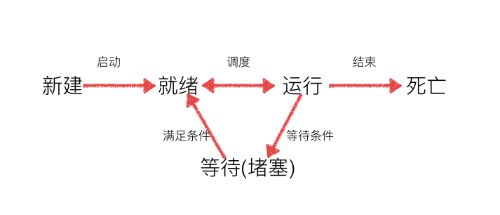

# 多线程

## 1. 多线程
Python的`thread`模块比较底层的，而`threading`模块是基于`thread`模块的包装，使用更加简单方便。

### 1.1 Thread

`threading.Thread`用法与 [multiprocessing.Progress](process.md#_2-process) 基本相同，相关参数配置也如出一辙，此处不再赘述。

```py {18,21,24,27,28}
from threading import Thread, enumerate,current_thread
import time


def sing():
    for i in range(3):
        print("singing %d" % i)
        time.sleep(1)


def dance():
    for i in range(3):
        print("dancing %d" % i)
        time.sleep(1)


def main():
    thread_sing = Thread(target=sing)  # 创建线程
    thread_dance = Thread(target=dance)

    thread_sing.start()  # 启动线程
    thread_dance.start()

    for thread in enumerate():  # 枚举所有线程(包括主线程)
        print(thread)

    thread = current_thread()  # 获取当前线程
    print(thread.ident)  # 获取线程id


if __name__ == '__main__':
    main()
```

### 1.2 自定义线程封装
与封装进程类似，我们也可以用同样方式封装线程。

```py {5,7}
from threading import Thread
import time


class PRThread(Thread):
    def __init__(self, request):
        super().__init__()  # 务必执行父类初始化方法
        self.__request = request

    def run(self):  # 会被自动调用
        time.sleep(2)  # 模拟耗时操作
        print("%s processed" % self.__request)


def main():
    thread = PRThread("request-0")
    thread.start()


if __name__ == '__main__':
    main()
```

* 每个线程有唯一`id`和`name`
* **主线程会等待所有子线程执行完毕后才会退出**

多线程程序的执行顺序是不确定的。当执行到sleep语句时，线程将被阻塞（Blocked），到sleep结束后，线程进入就绪（Runnable）状态，等待调度。而线程调度将自行选择一个线程执行。线程方法(指定`target`或默认`run()`)执行完成后线程退出。

线程的击中状态如下图所示。



## 2. 线程同步

进程拥有独立的内存单元，不共享任何数据，而进程内线程共享内存。 **全局变量可以在进程内的所有线程间共享，但局部变量各子线程独立不共享。** 

进程内多个线程并发修改共享资源时可能会导致脏数据，这时我们就需要同步线程执行。

### 2.1 join()
`thread.join()`会阻塞等待线程执行完成，使用`join()`可以控制线程执行顺序。

```py {16}
from threading import Thread

global_count = 0


def count(times):
    global global_count
    for i in range(0, times):
        global_count += 1


def main():
    thread1 = Thread(target=count, args=(1000000,))
    thread2 = Thread(target=count, args=(2000000,))
    thread1.start()
    thread1.join()  # 等thread1执行完毕后再启动thread2
    thread2.start()
    thread2.join()
    print(global_count)


if __name__ == '__main__':
    main()
```

### 2.2 互斥锁
线程同步最简单的机制是使用互斥锁(`threading.Lock`)。

某个线程要更改共享数据时，先申请(`acquire`)锁，获得锁后状态为`locked`，若此时另一线程试图获得这个锁，该线程就会变为`blocked`状态；直到拥有锁的线程释放(`release`)锁之后，锁进入`unlocked`状态,处于同步阻塞状态的线程可以重新竞争申请锁后修改共享资源。

```py {4,8,12}
from threading import Thread, Lock

global_count = 0
mutex = Lock()  # 创建互斥锁


def count(times):
    if mutex.acquire():  # 抢锁
        global global_count
        for i in range(0, times):
            global_count += 1
        mutex.release()  # 释放锁


def main():
    thread1 = Thread(target=count, args=(1000000,))
    thread1.start()
    thread2 = Thread(target=count, args=(2000000,))
    thread2.start()

    thread1.join()
    thread2.join()
    # 等待两个线程全部执行完毕后输出最终值
    print(global_count)


if __name__ == '__main__':
    main()
```

线程同步解决了脏数据问题，但会导致代码实际上以单线程模式执行，降低了并发性。另外若多锁控制失当可能会造成死锁问题。

### 2.3 死锁
在线程间共享多个资源的时候，如果多个线程分别占有一部分资源并且同时等待对方的资源，就会造成死锁。

```py {11,15,23,26}
# 死锁示例代码
from threading import Thread, Lock
import time

mutexA = Lock()
mutexB = Lock()


class MyThread1(Thread):
    def run(self):
        if mutexA.acquire():
            print(self.name + '----do1---up----')
            time.sleep(1)

            if mutexB.acquire():
                print(self.name + '----do1---down----')
                mutexB.release()
            mutexA.release()


class MyThread2(Thread):
    def run(self):
        if mutexB.acquire():
            print(self.name + '----do2---up----')
            time.sleep(1)
            if mutexA.acquire():
                print(self.name + '----do2---down----')
                mutexA.release()
            mutexB.release()


def main():
    t1 = MyThread1()
    t2 = MyThread2()
    t1.start()
    t2.start()


if __name__ == '__main__':
    main()
```

程序设计过程中要尽量避免死锁，如使用银行家算法。在可能出现死锁的地方阻塞添加超时时间可以在死锁超时时退出阻塞。

``` py
mutex.acquire(timeout=3)  # 设置抢锁超时时间为3s。死锁3s后当前线程不再继续阻塞直接退出
```

## 3. 数据共享
### 3.1 local()
如果线程要执行的任务逻辑非常复杂会往往会拆解到多个函数去执行，那线程内在多个函数之间如何进行数据共享呢。

#### 1）函数参数传递
```py
def crawl():
    data = download("https://colinchang.net/data")
    data = clean(data)
    save(data)

def clean(data):
    data = do_clean(data)
    return data

def save(data):
    save2db(data)
```
如果函数层次和参数较多，传递起来会比较麻烦。

#### 2) 全局字典
除了把数据作为参数进行传递，我们还可以使用全局变量来共享数据。那如何做到线程安全呢，我们简单地使用一个全局共享字典，用线程作`key`以避免不同线程间相互影响。

```py
from threading import current_thread

global_dict = {}

def crawl():
    data = download("https://colinchang.net/data")
    global_dict[current_thread()] = data
    data = clean()
    save()

def clean():
    data = dict[current_thread()]
    data = do_clean(data)
    return data

def save():
    data = dict[current_thread()]
    save2db(data)
```

#### 3) local()
`threading.local()`方法简化了线程内数据共享的问题。

```py {1,3,6}
from threading import local

global_local = local()

def crawl():
    global_local.data = download("https://colinchang.net/data")
    clean()
    save()

def clean():
    global_local.data = do_clean(global_local.data)

def save():
    save2db(global_local.data)
```

**`global_local`虽是全局变量，但每个线程都只能读写自己的独立副本，互不干扰**,可以理解为全局字典。其最常用于为每个线程绑定一个数据库连接，HTTP请求，用户身份信息等，这样一个线程的所有调用到的处理函数都可以非常方便地访问这些资源。

### 3.2 Queue
在[进程间通信](process.md#_4-进程间通信)中我们使用了两种进程安全队列实现了生产者消费者模式，而多线程中也有线程安全的队列(`queue.Queue`)。三种队列使用方式相同，队列的详细介绍可以参阅读 [进程间通信](process.md#_4-进程间通信)。

```py {2}
from threading import Thread
from queue import Queue
# from Queue import Queue # Python2
import time
import random


class Party(Thread):
    def __init__(self, queue):
        super().__init__()
        self.__queue = queue

    @property
    def queue(self):
        return self.__queue

    def run(self):
        pass


class Producer(Party):
    def run(self):
        while True:
            product = random.randint(10, 20)
            print("%s produced product-%d\t%s" % (self.name, product, time.ctime()))
            self.queue.put(product)  # 入队

            time.sleep(random.randint(1, 3))


class Consumer(Party):
    def run(self):
        while True:
            if not self.queue.empty():
                print("%s consumed product-%d\t%s" % (self.name, self.queue.get(), time.ctime()))  # 出队

            time.sleep(random.randint(1, 3))


def main():
    queue = Queue()  # 创建队列
    for i in range(2):
        Producer(queue).start()  # 创建2个生产者
    for i in range(3):
        Consumer(queue).start()  # 创建3个消费者


if __name__ == "__main__":
    main()
```

## 4. 全局解释器锁 (GIL)

### 4.1 GIL
GIL(Global Interpreter Lock)是CPython中一个防止解释器多线程并发执行机器码的一个全局互斥锁。其存在主要是因为在代码执行过程中，CPython的内存管理不是线程安全的。

GIL是最初为了适应多核CPU而引入多线程开发时的一种解决多线程之间数据完整性和状态同步的机制全局互斥锁。

GIL机制慢慢暴露出低效率的问题，但完全摒弃异常困难。GIL其实是功能和性能之间权衡后的产物。GIL在不断被改造，但在较长一段时间内仍将会继续存在。

### 4.2 伪多线程
GIL作为全局锁的存在会对多线程的效率有很大的影响，导致CPython下的伪多线程，甚至就几乎等于是个单线程。

CPython中线程就是C语言的一个pthread，并通过操作系统调度算法进行调度（例如linux是CFS）。为了让各个线程能够平均利用CPU时间，Python会计算当前已执行的微代码数量，达到一定阈值后就强制释放GIL。而这时也会触发一次操作系统的线程调度（当然是否真正进行上下文切换由操作系统自主决定）。

```py
# GIL原理伪代码

while True:
    acquire GIL
    for i in 1000:
        do something
    release GIL
    # Give Operating System a chance to do thread scheduling
```
这种模式单核CPU下没有问题，多核CPU情况就不一样了。从release GIL到acquire GIL之间几乎是没有间隙的，当其它核心上的线程被唤醒时，大部分情况下主线程已经再一次获取到GIL，此时被唤醒的线程无法抢到GIL只是白白浪费CPU时间，到切换时间时进入待调度状态，再被唤醒，再等待，以此往复恶性循环，当然实际的GIL并非如此简单，它也在版本升级中不断的被优化。

GIL的存在一定程度上对操作系统线程调度资源造成了浪费，导致多线程无法很好的利用多核CPU的并发处理能力。只有对IO密集型操作，GIL才能起到一定积极作用。

### 4.3 避免GIL影响
了解了GIL存在的问题，我们可以从如下几个方面入手避免其负面影响。

#### 1) 使用多进程和协程
[多进程](process.md)的出现很大程度上是为了弥补因为GIL导致的[多线程](thread.md)低效的缺陷。每个进程有独立的GIL，因此也不会出现进程间的GIL争抢。

多进程可以充分利用CPU的多核计算能力，但进程也会比线程占用更多资源，同时带来进程间通讯的问题。多线程不能利用多核CPU，但却可以节省资源消耗。一般情况下，**在计算密集型应用中使用多进程，IO密集型应用中使用[协程](coroutine.md)或多线程。**

#### 2) C语言混合开发
对并行计算性能较高的程序可以考虑核心部分使用C语言开发，然后使用C模块引入Python实现混合开发。

#### 3) 其他解释器
我们直到GIL是CPython的产物，JPython和IronPython开发语言自身实现了真正的多线程，也不需要GIL的帮助。使用这些解释器也会带来无法利用社区众多C语言模块的问题。

> 参阅文档 https://blog.csdn.net/qq_34802511/article/details/81227200